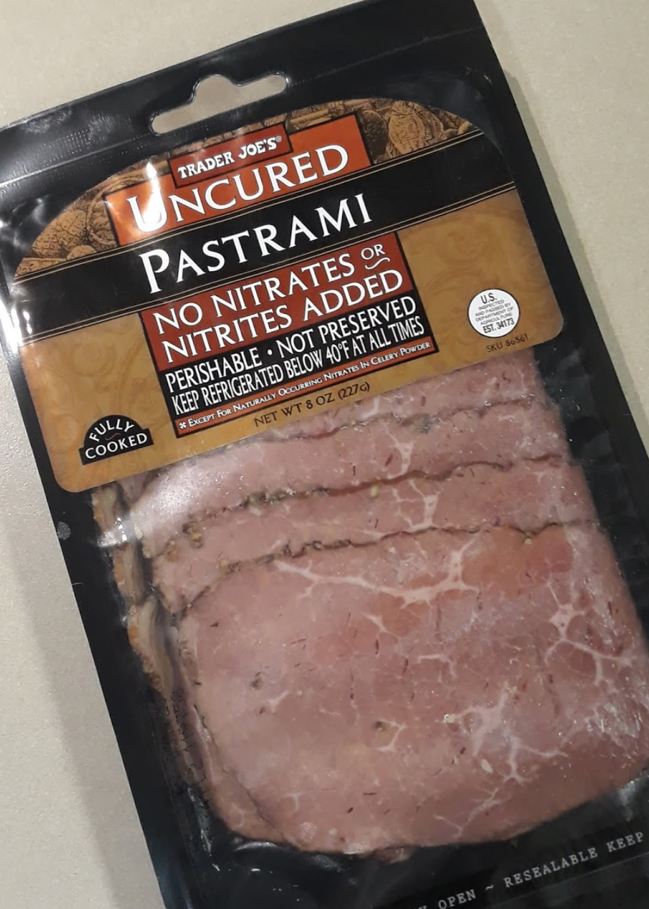

# 菜谱

本页分享一些我个人平时爱吃的homemade美食，作为读书时的快乐伴侣。每一个section作为一顿饭来记录。（因为一直想找个地方记录菜谱，方便自己看，突然想到可以放在读书笔记中）

本人比较喜欢吃肉，所以菜谱中基本看不到蔬菜的影子。一般需要根据当日饮食和天气适度补充维生素B、C、D。

## 早餐

我对早餐的要求就是好吃以及热量到位。

### 煎炸全餐+小面包+拿铁

这是最近新发现的一个新的吃法，在trader joe发现了一个叫做CIABATTA ROLLS的面包（这里就叫做小面包来代替），于是组合出了一个以烤小面包为主食核心，吸收英式打工人早餐全餐的吃法：

{style="display:block; margin:auto; width:300px;"}

这个面包口感和法棍很像，又不像法棍那么大一个人吃不完。以前我一直觉得法棍好难吃，后来发现加热后会好吃，所以这个也一样的，需要烤箱加热3-4分钟。

最终组合：

以这个小面包为主食（x1或者x2），配煎培根x2、煎蛋x1、煎香肠x1，然后放一些冰箱里能直接吃的免洗蔬菜，就完成了。饮料配经典的拿铁。

综合评价：

| 项目     | 评分       | 评价                         |
| -------- | ---------- | ---------------------------- |
| 设备要求 | ★★★☆☆ | 需要烤箱和煎锅               |
| 方便程度 | ★★★☆☆ | 需要预热烤箱                 |
| 营养结构 | ★★★☆☆ | 蛋白质充足，钠偏高，蔬菜偏少 |
| 热量估计 | ★★★★★ | 充足，约700kcal              |

升级考虑：烤面包的时候考虑可以烤番茄

## 午餐

我对午餐的要求也是热量到位

### 红烧牛肉面

这是我发明的一个懒人做法，主要用料是COSCO的牛肋骨：

{style="display:block; margin:auto; width:300px;"}

把牛肋骨放入电高压锅中，依次放入：

* 香料：八角、香叶、草果、小茴香
* 辣椒：干辣椒
* 酱汁：李锦记红烧酱油、李锦记味极鲜酱油
* 放之前直接撒盐，不要出锅再撒。因为高压锅所以撒盐后肉不会柴，撒盐反而让肉不会太碎。

然后高压模式压40分钟左右，即可出锅。

接着煮想吃的任何类型的面/粉，一般我还会配一个蒸蛋器的半熟蛋。

最终组合：

牛肋骨两根，面一把，鸡蛋一个，即食蔬菜一把

综合评价：

| 项目     | 评分       | 评价                                 |
| -------- | ---------- | ------------------------------------ |
| 设备要求 | ★★☆☆☆ | 需要电高压锅和煮锅                   |
| 方便程度 | ★★★★☆ | 把原材料扔进去就行了和蒸米饭一个难度 |
| 营养结构 | ★★★★★ | 蛋白质充足，碳水合理                 |
| 热量估计 | ★★★★★ | 适中，约600kcal                      |

升级考虑：优化香料配方或者找到代替香料包，优化做饭流程

### 煎牛排

围绕COSTCO的New Yorker Strip Steak学会的一套煎牛排做法。纽约客牛排位于牛的短腰部，牛排各部位的区别和辨别方法目前还没有弄明白，反正就是超市最常见的一种吧。在漫长的摸索中逐步摸索出了我自己吃着比较好吃的一种牛排煎法，熟度咱不明。

煎牛排的要点：

1. 如果是分装冷冻的，提前一晚解冻；分装冷冻的时候减少空气以防冻伤
2. 煎牛排前半小时拿出来，恢复到室温水平
3. 煎之前再撒黑胡椒和海盐，不要提前撒
4. 平底锅油温烧到下牛排时会发出“兹拉”的声音
5. 下牛排，煎一分钟
6. 翻面，再煎一分钟
7. 下黄油、迷迭香、蒜片等，煎一分钟
8. 翻面，再煎一分钟
9. 出锅装盘，可适量倒一点油撒在牛排上
10. 醒三五分钟后就能吃了

### 烤羊排

用一般美国比较常见的法式切法的小羊排，适合烤制。

羊排调料：一定要用干料

涂抹avocado oil 烟点500F以上

black pepper 胡椒粉、dark brown suger 红糖、smoked paprika 烟熏辣椒粉、chili powder辣椒粉、ground mustard 芥末粉、cumin powder 孜然粉

简单版本：洋葱、黑胡椒、盐、小茴香、辣椒粉

做法（腌制部分）：

1、用水清洗，然后用厨房纸把水分擦干

2、撒一层细盐（不要太多），用手抹匀

3、蒜末（最好是蒜蓉），加孜然颗粒、辣椒粉、盐、花生酱，搅成糊，均匀抹在羊排上

4、放进密封袋，冷藏10小时

做法（烤盘）：

1、锡纸铺在烤盘上，放上羊排

2、用锡纸完全裹好羊排

3、400F，20分钟

4、拿出来后，正反面撒上孜然，打开锡纸

5、400F，15分钟

## 晚餐

我对晚餐的要求是控制热量，并不能吃太晚；晚餐减少碳水摄入，不在晚餐时段吃面、粉、米饭等以主食为主的饮食。

### 墨西哥饼卷

这个配方是我一直找不到合适的吃墨西哥卷饼的搭配时发现的一个非常方便的牛肉：

{style="display:block; margin:auto; width:300px;"}

这个即食烟熏牛肉片非常适合夹在卷饼里吃，味道还不错。由于是非传统腌制，所以盐含量并不像其他腌肉那么高。

墨西哥卷饼也可以直接吃，不过我一般会用平底锅热一下，不热的话影响也不大。热的话就干锅烫一下就行了。

一般我还会煎一片培根，但有时候不那么饿的话就不加培根了。

最终组合：

即食烟熏牛肉片x2，墨西哥饼x1，即食生菜，是拉差酱，（煎培根一片）

综合评价：

| 项目     | 评分       | 评价                         |
| -------- | ---------- | ---------------------------- |
| 设备要求 | ★★★★★ | 什么都不需要就能做           |
| 方便程度 | ★★★★★ | 一般两分钟可以搞定           |
| 营养结构 | ★★★☆☆ | 虽然整体营养均衡，但是钠偏高 |
| 热量估计 | ★★★★★ | 晚上非常适合，约300-400kcal  |

升级考虑：寻找低钠培根以及好吃的非烟熏制的即食牛肉片或者别的什么
