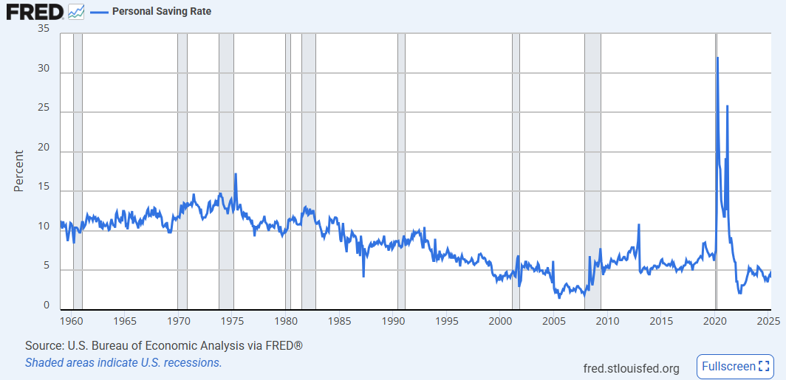
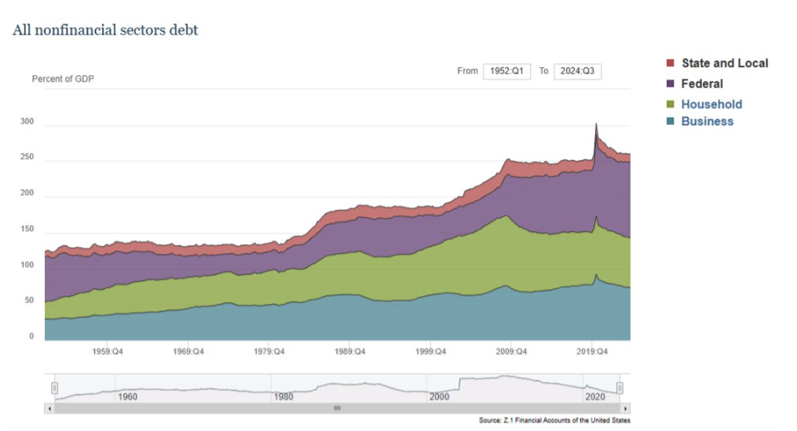
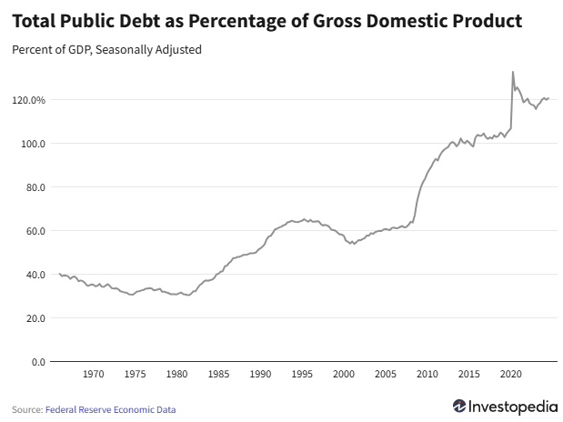
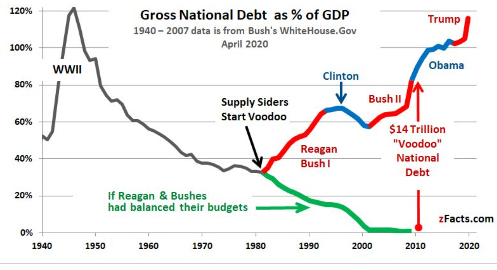
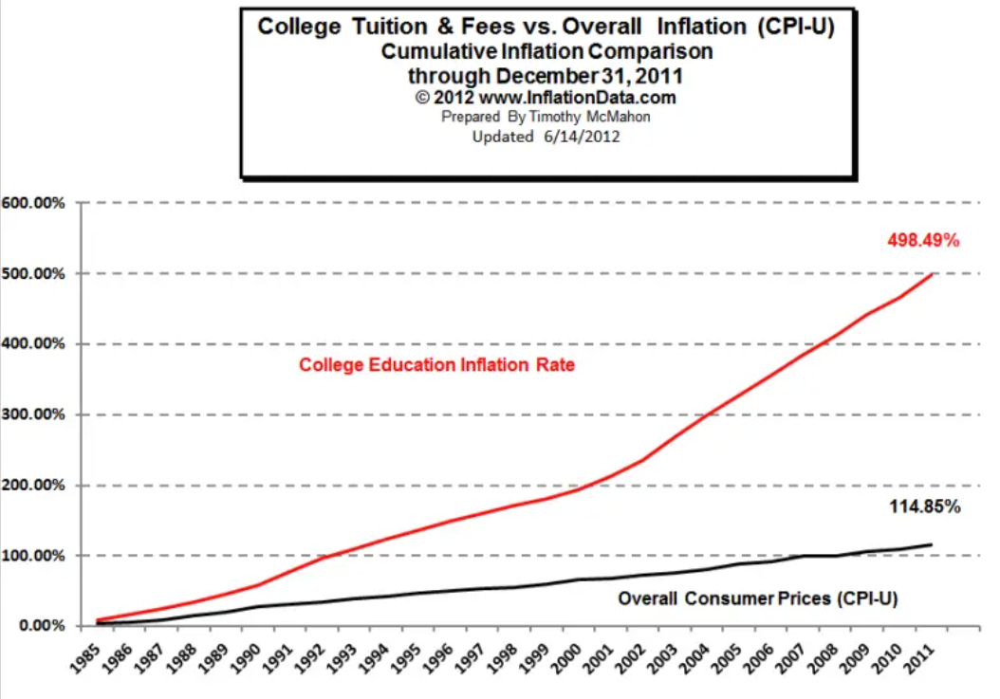

# Killing the Host

by Michael Hudson (2015)

本页面的内容为读书笔记，主要记录整理了本书的核心观点，仅供学习讨论使用，并非原文翻译，也禁止用于商业用途。原文请在Amazon等合法渠道进行购买。

## 引言（Introduction）

本书源于哈德森将其更具学术性的著作《The Bubble and Beyond》通俗化的尝试。书中内容涵盖美国、爱尔兰、拉脱维亚、希腊等地的经济分析，许多观点最初发表于《CounterPunch》上。

哈德森并非一开始就立志成为经济学家。在芝加哥大学读书期间，他未选修任何经济学课程。1961年前往纽约后，他因一次与朋友 Terence McCarthy 的深入交流而被经济系统的运作方式所吸引。Terence 是一位经济学家，曾翻译《剩余价值理论》（Theories of Surplus Value）第一部分，建议他从重农学派（Physiocrats）起，阅读洛克（John Locke）、亚当·斯密（Adam Smith）、李嘉图（David Ricardo）、马尔萨斯（Thomas Malthus）与穆勒（John Stuart Mill）等。

哈德森发现，最吸引他的问题——例如债务动态、房贷与房价的联动、FIRE 部门（Finance, Insurance, Real Estate）对国民收入的吸纳——在纽约大学经济系中从未被教授。为了研究这些议题，他进入银行业实际操作。

在储蓄银行信托公司担任经济学家期间，他负责追踪储蓄如何生成利息并转化为抵押贷款。他的图表显示，储蓄增长趋势如同葛饰北斋的“神奈川冲浪里”，每季度分红日脉冲跳动如心电图。

银行向购房者放贷，助推战后房地产价格上涨。随着贷款和房价同步攀升，这一机制仿佛永动机般制造中产财富。人们以为自己在储蓄，实则通过债务驱动资产升值致富。直至泡沫破裂，因不断扩张的债务超出收入偿还能力。

房地产成为理解“纸上财富”膨胀的关键。尽管它是家庭最大资产与债务来源，土地租金与估值却未出现在经济学博士课程中。

1964年，哈德森加入大通曼哈顿银行（Chase Manhattan Bank）担任国际收支分析师，研究拉美国家如何利用出口收入偿还外债。他发现这些国家早已“借贷饱和”，只能靠 IMF 或商业银行续贷以支付利息。

他指出，债务滚动加上复利增长将不可避免地引发违约危机。1982年墨西哥违约，印证了这一判断。与抵押债务不同，第三世界债务最终在1980年代通过“布雷迪债券”（Brady Bonds）重组削减。

哈德森在银行的另一项任务是分析美国石油产业的国际收支。他揭示“转移定价”（transfer pricing）与“方便旗”（flags of convenience）如何使石油公司将利润迁至避税地，规避征税。由此他发现，美国国际收支赤字源自海外军事支出，而非私人部门贸易投资。

1968年他为安达信会计事务所（Arthur Andersen）研究整个美国支付流，发现美国在1960年代的国际赤字几乎全由军费造成。

**1969年，哈德森受邀在新学院（The New School for Social Research）讲授国际贸易与金融，他在教学中发现，主流理论回避了军费、资本外逃与金融避税等关键现象。IMF 的正统理论认为，只要压低工资并贬值货币，任何国家都可偿还债务——这在现实中屡屡失败。**

**他批评“芝加哥学派”（Chicago School）以货币量决定商品与工资价格，却忽略资产价格与债务服务成本对实体经济的影响。他认为，主流理论与现实运行方式几乎相反。**

在新学院的三年研究中，哈德森发现18世纪的“重商主义”（mercantilism）理论在理解当代经济问题方面反而更具洞见。他指出，早期经济学家如亚当·斯密（Adam Smith）已警告政府过度依赖债权人：

“公共债权人并不关心土地或资本状况良好与否……其毁灭对他而言可能毫无察觉，亦无直接影响。”

哈德森在1970年代初即提出，第三世界国家将无法偿债。这一观点当时遭学院与政策界冷遇。直到1982年墨西哥宣布违约，引发拉美“债务炸弹”，人们才重新审视。

1972年他出版《Super Imperialism: The Economic Strategy of American Empire》，阐述美元脱钩黄金后，美国如何通过对外赤字将军费转嫁全球，而外国央行回购美债反向资助美国财政赤字。

这一机制赋予美国前所未有的“免费金融搭便车”特权。哈德森因此被邀请加入哈德逊研究所（Hudson Institute），并获国防部资助，进一步分析美国如何从中受益。

1979年他出版《Global Fracture: The New International Economic Order》，预测**美国的金融霸权将导致全球沿债务关系出现地缘政治裂痕**。换句话说，美国不再依靠军事占领来控制其他国家，而是通过美元、IMF贷款、债务体系让他国对美国金融资本产生依赖，这成为一种新形势的帝国主义，即“金融帝国主义”。

读者注：这里的意思是，当金融资本像寄生虫一样吸取他国经济剩余的时候，这种不稳定的结构会导致周期性金融危机、社会动荡与民粹反弹，最终会出现金融阵营对抗及货币竞争。

在联合国训练研究所（UNITAR）任顾问期间，他强调 IMF 的“结构调整”（structural adjustment）方案会加剧债务国的困境——削减社会保障、出售基础设施、引入国际资本攫取本地资源，实质是全球化条件下的新一轮阶级斗争。

1980年在墨西哥的 UNITAR 会议上，他坚持违约不可避免，引发争议。银行虽然明知现实，却坚持“债务必须偿还”，以将责任归咎于债务国。

这促使他转向历史研究，探索债务制度的起源。他发现，**古代近东文明中的庙宇与王宫才是最早的债权人，债务并非市场交易的自然产物，而是国家结构的一部分。统治者能定期赦免债务，维持社会稳定。**

他将研究结果展示于学界，最终受邀成为哈佛大学 Peabody Museum 巴比伦经济史研究员。

1999年，Scudder, Stevens & Clark 聘请他设立全球首个主权债券基金（sovereign bond fund），注册于荷属安的列斯群岛，专注投资拉丁美洲高息美元债。

尽管欧美投资人犹豫不前，当地持有本国外债的精英却积极认购，因他们能通过离岸账户稳定收息。这显示金融精英有意维持本国债务循环。

哈德森曾试图向主流出版社推销关于金融危机的预警书稿，却被认为“太消极”。他意识到公众往往在危机爆发后才愿意面对真相，于是将重心转回学术。

1990年3月，他发表文章提出三大结论：**利息、债务、信用制度源于中央机构（庙宇与王宫），并非个人自由交易。**利率的设定反映的是计量便利，而非生产率：如美索不达米亚为月利1/60，希腊年利1/10，罗马1/12。

这些观点现已获得亚述学（Assyriology）与考古学界广泛认可。2012年，大卫·格雷伯（David Graeber）在《Debt: The First 5000 Years》中整合了哈德森的研究成果，使债务赦免制度重新进入公共讨论。

哈德森与哈佛大学合作成立了长期经济趋势研究所（ISLET），定期组织会议，探索经济起源、土地所有权、债务制度与经济货币演变。

如今，他们已出版五卷系列著作，重塑西方早期经济史，揭示古代混合经济体如何处理债务问题，反观当代世界在亲债权体制下的极端化与两极分化。

1990年代中期，哈德森加入 Levy Institute 与密苏里大学堪萨斯分校（UMKC），与 Hyman Minsky、Randy Wray、Stephanie Kelton 等人共同发展“现代货币理论”（Modern Monetary Theory, MMT）。其目标是应对由债务引发的失业与财产转移。

2004年，他在堪萨斯市展示了金融模型，并于2006年登上《Harper’s》杂志封面。该模型成功预测了2008年危机，其后他在《Financial Times》上连发专栏，指出冰岛与拉脱维亚是欧美危机的预演。

**债务的压迫性力量早在18、19世纪已广为认识，但主流经济学却将经济思想史排除在外，转而支持亲债权、紧缩与反政府政策，同时鼓吹对大银行的纳税人救助。**

媒体与高校传播了一幅扭曲的经济图景，使大众误以为这就是现实。

这正是本书所揭示的奥威尔式语言操控：**金融与租金部门伪装成“经济核心”，实则是寄生系统，以欺骗宿主并掠夺其生命力。这，就是现代金融如何“杀死宿主”的真相。**

在序言部分的最后，作者写道：

> This pattern of debt is what classical economists defined as unproductive, favoring unearned income (economic rent) and speculative gains over profits earned by employing labor to produce goods and services. I therefore start by reviewing how the Enlightenment and original free market economists spent two centuries trying to prevent precisely the kind of rentier dominance that is stifling today’s economies and rolling back democracies to create financial oligarchies.
>
> To set the stage for this discussion, it is necessary to explain that what is at work is an Orwellian strategy of rhetorical deception to represent finance and other rentier sectors as being part of the economy, not external to it. This is precisely the strategy that parasites in nature use to deceive their hosts that they are not free riders but part of the host’s own body, deserving careful protection.

即：“如今的债务体系，本质上正是古典经济学家所批判的那种非生产性结构：它鼓励靠“躺赚”——经济租金和投机获利，而不是靠实际劳动和创造来获取利润。因此，我要从启蒙时代讲起，讲那些最初支持自由市场的经济学家们——他们曾努力了两个世纪，只为避免今天这种食利者掌控一切的局面——一个正在扼杀经济活力、倒退民主制度、扶持金融寡头的世界。

在展开分析前，我们必须先指出：我们现在面对的，其实是一种“奥威尔式”的语言陷阱。金融资本和其他食利行业被巧妙包装为“经济的自然组成部分”，而不是外来的剥削者。这正如自然界中的寄生虫，它们欺骗宿主，以为自己就是宿主体内的器官之一，值得保护、甚至供养。”

## 读者序言

本篇是刘杰夫的读书笔记之第一篇，这本书暂时还没有找到中译本，所以可能在一些专有术语上有一些翻译问题。

我曾拿过一个经济学硕士学位，但那个学位对我理解这个世界帮助很有限。很显然，如今世界的种种乱象，已经不是所谓的“主流经济学”所能解释的了。主流经济学讲了一套又一套模型系统，似乎陷入了自证陷阱。

如今的主流经济学主要以新古典经济学派（微观经济学）和凯恩斯经济学派（宏观经济学）为基础，他们无法解释如下事实：

* 供需曲线无法解释美国房租越来越高的问题，金融化和资产泡沫并未被系统性解释。
* GDP上升但生活质量下降。
* 医疗、教育等基本服务价格暴涨的真正原因。
* 数字时代的种种乱象，如虚拟繁荣、心理焦虑、消费加深、虚拟租金化等。
* 服务业吸取最多的利润，却并未创造出实际产品。
* 虚拟货币的出现和大规模的使用。

这一轮的反思来源于我近几年的生活经历和学习经历。在工作一段时间后，以及在人工智能的爆发之下，我返回学校学习计算机科学和人工智能的知识，在此期间接触了强化学习，并意识到其展现出的惊人魅力远超之前修读经济学学位时所学的博弈论。在博弈论中，每位参与者都被假设是完全理性的，这显然和现实不符。此外，博弈论适用于封闭的游戏结构，而现实是非封闭的，规则经常调整、权力有寻租现象、根据既定的法规也有特别的对策等。还有就是现实中权力、资源、信息总是不对称的，这是一种系统性的结构，而博弈论忽视了这种现实结构。

举例来说，现实中一个卑微的打工人是没办法和一个资本家讨价还价的；国际贸易谈判也无法达到所谓的均衡，所有的谈判都受到个人风格、整体社会文化的影响，而无法达到平衡、不断动态变化；在现实中，一个人受了气，很难忍气吞声用所谓的理性去压抑自己……因此，当我看到强化学习能不断适应现实问题时，我也开始思考我所学的经济学模型是否有更好的替代理论。我们想知道的或许是：这个世界到底发生了什么、正在发生什么，而不仅仅是如果这个世界符合假设、那么我们就可以使用这个模型……

我们应当关注这个混乱的现实，把那些混乱的现实因素加入到我们思考的体系中，而不是一味地去把现实作以简化。我曾经带过一段时间经济学的课程，每次课程开始时我都会说：经济学是一门社会科学，因为它是一门科学，所以我们要对复杂的现实进行抽象简化……

但当我目睹了这几年的世界乱象后，我开始意识到这种思维方式是行不通的。如果所有国家都能遵循所谓的共识机制去发展，那么我们可以有更多的时间来优化模型本身，但如今经济体系已经走到了崩溃的边缘，我们不得不回到经济学最开始的时候：回归其政治性，重新探讨如今经济运转的深层情况。

**宿主（host）是本书的重要内容，在后面会展开来说明。**举例来说，在房地产行业中，银行放贷、购房者背贷、房价上涨、房贷利息转换为金融利润、最终家庭/政府陷入负债循环，在这个过程中，金融体系的扩张并未创造新价值，反而是不断榨取真正创造价值的工人、工业企业、纳税人、政府、购房者等“宿主”的财富。

在哈德森等人眼中，**FIRE部门**，即Finance（金融）+ Insurance（保险）+ Real Estate（房地产），是三个高度金融化、以租金收入为主的部门。在1970年代，随着美国从制造业经济转向服务业和金融主导的经济结构的时候，FIRE部门不直接生产商品，而是通过利息、保险费、租金等方式获取非劳动性收入。在哈德森等人眼中，这是一种租金攫取型资本主义（rentier capitalism）。FIRE部门的扩张并不创造财富，而是通过债务、房贷、金融衍生品、资产泡沫等方式从真实经济（生产与劳动）中抽血，而这也就是本书的主题“杀死宿主”的主要方式。

哈德森认为，当前美国的经济结构为一种“债务驱动型的寄生型金融资本主义”，其核心特征包括：

* **经济以FIRE部门（金融 Finance、保险 Insurance、房地产 Real Estate）为中心** ；
* 真实财富不再依靠工业生产和劳动力创造，而是依赖 **资本增值、资产价格膨胀与债务扩张** ；
* 金融机构不是服务于生产，而是攫取经济剩余；
* **债务成为增长的“燃料”与控制工具** ，个人、企业与政府都被锁定在还债循环中；
* 整个体系通过**美元霸权**对外输出金融风险与赤字，使美国可以以债养债、不需真正偿还。

哈德森将其比喻为 **寄生生物** ：这些金融资本并不直接参与“身体”的生长（生产），却不断从宿主体内汲取养分。

哈德森认为，这种模式必将走向系统性衰败和内耗：

* **长期债务负担加重** → 削弱消费力、投资意愿与社会稳定；
* **周期性泡沫破裂** → 每一轮都造成更深层的结构破坏（如2008、2020）；
* **生产性经济萎缩** → 工业与劳动被边缘化，国家“空心化”；
* **社会分化与民主退化** → 贫富差距扩大，公共部门功能萎缩，社会撕裂。

哈德森反复批评虚假繁荣现象，比如如今美国人均GDP高达8万美元以上，并非代表人民过得好，反而是因为：

* **GDP 被金融活动、人均资产膨胀拉高** ：
  * 金融服务、房地产交易、专利估值都计入GDP，但不等于真实财富；
  * 例如，股价上升和房价暴涨增加了GDP，但并不提高生产或大众生活质量。
* **人均数字被超级富豪“平均”** ：
  * 财富严重集中，GDP的增长集中于前1%人群；
  * 实际中位数收入与生活水平增长远低于GDP数据反映。
* **FIRE 部门高利润、高杠杆**放大了表面经济指标。

此外，如今人们热议的美国国债问题，正是哈德森在五十年前就开始持续关注的问题：

* **美元霸权支撑下的“债务帝国主义”** ：
  * 1971年后，美元不再与黄金挂钩，全球必须持有美国国债作为储备；
  * 美国可以用财政赤字买全球商品、发动战争，再把这些美元“出口”出去，由他国央行买回国债。
* **财政赤字成为全球金融体系核心环节** ：
  * 他国必须“被迫接受”美国债务，以维持与美元体系的联系；
  * 这让美国得以无约束借贷，不必像常规国家那样担心偿债能力。
* **国内政治结构锁定了赤字模式** ：
  * 减税政策 + 高军费 + 医疗支出增长 + 政治极化 → 无法削减赤字；
  * 高债务反而成为“常态”，无人真正想或能还清。

换句话说，高国债既是美国维持金融帝国主义霸权的结果，也是一种手段。

对于美国的结局，哈德森认为美国并不会突然崩溃，而是陷入非灾难式的慢性衰退，其表现包括：

* 越来越依赖债务维持消费与金融泡沫；
* 工业生产与基础设施继续衰退；
* 社会更加分裂，中产阶级被债务压垮；
* 全球范围内对美元霸权的反抗逐渐增强，美元信用将被逐步侵蚀；

最终不是灭亡，而是走向一种“ **低增长、高不平等、债务锁定、治理功能退化** ”的状态 —— 这正是他所说的：

> Financial parasitism is killing the host—not by destroying the body overnight, but by draining its life over time.

> “金融寄生正在杀死宿主——不是一夜之间毁灭它，而是逐渐耗尽它的生命力。

以上只是一个简略的概括和引导，更多的关键内容请在本书的正文部分学习。

## Ch.0 寄生宿主与经济大脑控制总论

本书一共有29个章节，其中在正式章节之前还有一篇《The Parasite, the Host, and Control of the Economy's Brain》以及十二大主题的划分。我把这篇文章称为全书的“总论”（Theme.0），即本书的核心理论框架。然后在总论后，我会以十二大主题（Theme.1 - Theme.12）和单独的第二十九章（Theme.13）分别展开来叙述。

由于本章内容是作者全书的总论及理论框架的浓缩，所以我们可以减少总结而更多关注于作者的思想背景。

---

**0.1 什么是寄生者？**

寄生者的词语演变：

1. 古希腊时陪同征粮官员的助手
2. 罗马时代带有贬义的白吃白喝的人
3. 中世纪时的高利贷者被称为寄生虫和吸血鬼，这个时候parasite才传入生物领域称为寄生虫的来源

---

**0.2 聪明寄生和自毁式寄生**

寄生者离不开宿主，而往往会演化出一种互利的共生关系。有些寄生生物会帮助宿主寻找更多食物，有些则保护宿主免受疾病侵扰，因为它们知道，宿主的成长最终也将惠及自身。

{style="display:block; margin:auto; width:500px;"}

**寄生（共生关系）的主要发展：**

1. 在古代美索不达米亚及古希腊罗马，神庙与宫廷一直是主要得债权人：通过铸币、建造基础设施来获得回报
2. 中世纪的圣殿骑士团和医院骑士团推动了欧洲银行业的复兴
3. 文艺复兴时代和进步时代在公共投资和私人融资之间实现了富有成效的融合
4. 19世纪，金融、政府、实业三方共生，德国与中欧模式最为成功，建立了国家支持的混合经济体系

**此刻，关于共生关系的下一步发展产生了两种方向：**

1. 第一个方向是19世纪的经济学家为了让共生关系可持续发展，主张将议会从上议院中解放出来，因为上议院代表既得利益集团，而下议院代表更具民主色彩；人们认为普选将带来代表社会长期利益的政府，而公共机构将主导重大资本投资，比如道路、港口、通信、发电、基础公共事业和银行业等，避免私营掠租者插手其中。
2. 第二个方向则是将基础设施私有化，以类似“遥控地主制”（absentee landlordship）的方式运营，使得拥有权力的租金攫取者得以设立“收费站”，向社会索取市场能够承受的任何代价。这种私有化背离了古典经济学家所设想的自由市场。他们所倡导的“自由市场”（free market），应当摆脱向世袭地主阶层支付的地租，也不应被迫支付给私人资本家用于利息和垄断所形成的“租金”。理想的制度应是一个道德上公平的市场体系（a morally fair market），**人们因其劳动和企业活动而获得回报，而不是因未对生产或社会需求作出积极贡献而获得收入。**

我们应该如何选择呢？在当时，古典经济学家们普遍都警告说：掠租行为将抽走收入、推高价格至高于必要生产成本。

**古典经济学家们的主要观点包括：**

1. 试图阻止地主、自然资源所有者和垄断者以高于成本价值的价格出售产品，即反对坐享其成的食利者来掌控政府。（因为历史上的巨额财富基本都是通过掠夺手段积累起来的，无非是高利贷、战争贷款或者政治上的内部交易。如果任由食利者掌控政府，那么无疑就是允许对公共资源的攫取然后私有化为垄断特权。）
2. 警告依靠垄断资源来收取租金会抽走社会剩余，推高成本，抑制生产与消费。
3. 市场应道德公平，鼓励生产性劳动与企业家精神

**换句话说，维持共生的制度条件包括：**

1. 政治改革，削弱既得利益团体的阻力，让公共利益主导资本分配
2. 公共投资主导重要基础设施，避免私营资本设立收费站，防止基础设施私有化形成遥控地主制

于是，19世纪流行起了一种观点：**金融巨头、地主和世袭统治阶级本质上是“寄生者”**。法国无政府主义者普鲁东的口号“**财产即盗窃**”（property as theft）正是这一观点的体现。

在本书的后面章节中，我们会进一步展开探讨。那么作者在这里直接点名了如今美国的金融体系现状：

1. 金融寄生化：没能建立起生产和消费经济体的互利共生关系，金融体系的寄生掠夺行为正在抽干原本可用于投资和增长的收入，即债务利息、分红等不断掠夺实体经济。
2. 基础设施私有化：几乎一切能私有的部门都进行了私有化转移。
3. 摊还在勒索宿主：银行家和债券持有人通过提取利息和分红，令宿主经济日渐枯竭。

注：偿还贷款，即所谓“摊还”（amortization，字面义为“使之死亡”）的过程，使宿主规模萎缩。mortgage（按揭贷款）一词本身也含有“死亡”（mort）的词根——它代表的是来自过去的索偿之“死手”（dead hand）。当一个经济体被金融资本占据并主导时，它就如同一座“停尸房”（mortuary），其宿主经济不过是任由金融掠食者享用的一顿“免费午餐”：后者收取利息、手续费与各种费用，却不对生产过程作出任何贡献。

这里，作者提出了一个最终的追问：**宿主是否注定要死？是否还可能建立正面的共生关系？**

**答案取决于宿主在面临寄生性攻击时，是否仍能维持其自主调节的能力，抵御自毁式寄生的侵蚀。**我们在读完这本书后，可以尝试来回答这个问题：美国的金融体系所寄生的这个宿主是否注定会死亡。

---

**0.3 谁是控制宿主的大脑？**

**现代生物学的巧妙定义：通过削弱宿主的正常防御机制来实现控制。**

为了被接纳，寄生者必须让宿主相信自己并未遭到攻击。为了在不引发抵抗的情况下攫取“免费午餐”，寄生者需要控制宿主的大脑：首先让宿主意识模糊，不觉察有入侵者附着其身；接着让宿主相信这个寄生者并非掠夺，而是有所助益，并且要求不过分，仅索取其提供服务所“必须”的花费。

本着这样的逻辑，银行家将其收取的利息描绘成经济中一种必需且善意（necessary and benevolent）的存在——他们提供信贷以促进生产，因此理应分享所帮助创造的剩余价值。

**其策略可以总结如下：**

1. **让宿主不觉察入侵**
2. **让宿主相信寄生者是有益的**
3. **将攫取行为伪装为必要服务费用**

我们来一一看一下：

**让宿主不觉察入侵（麻痹防御机制）：**

1. 用技术性语言掩盖真实收入来源：在NIPA（国民收入与产品账户）中，将FIRE部门的零和攫取行为计入国民收入，不设经济地租分类，使公众无法区分创造性与寄生性收益。
2. 反复喊口号：所收即所得（All income is earned）：让人忽视金融部门如何把本属于经济的养分转移出去，来喂养那些来自于前工业时代的垄断与掠租性行业，让社会误以为没有不劳而获者。
3. 通过上述手段，经济地租的存在与规模被抹去，寄生性收入不仅合法化而且合理化，统计数据成为谎言的逻辑性支持而实际上统计数据本身就是被人为设定并掩盖了真相的。

**让宿主相信寄生者是有意的（建立虚假互惠关系）：**

1. 银行业自我描述为“经济促进者”，即信贷有助于生产，因而利息是合理回报。
2. 垄断企业宣称其利润是其创新回报。
3. 投资银行、保险工资以保障资本市场效率之名义获取租金性收入。
4. 房东和金融机构标榜自己提供了服务，即付出了劳动。
5. 垄断企业通过广告与公共关系活动把自己包装成公共服务提供者。

**将攫取行为伪装为必要服务费用（合理化掠夺行为）：**

1. 同样的喊口号方式：“价格即价值”。既然市场已经为此定价了，那么就应该认为一分钱一分货。这种口号忽视了其明显高于实际服务成本的定价。
2. 用“公允价值”、“自由市场”等包装不合理的索取，将“没有免费的午餐”（芝加哥学派， There is no such thing as a free lunch）伪装成自由市场的道德口号。这种口号掩盖了私人领域的免费午餐。
3. 将地租与垄断利润视为正常经营收益。商学院、智库、主流经济学界为食利阶层正名，鼓励将攫取性收入视为市场效率的体现。

**所谓“食利经济”，是指个人乃至整个行业凭借对财产与特权的占有（往往还是继承而来的）向社会征收费用。正如巴尔扎克所说，最巨大的财富往往起源于盗窃或内幕交易，其具体过程早已湮没于历史迷雾之中，却因惯性而被社会默认为合法。**

食利经济（寄生性经济）的核心思想来源于**地租攫取（rent extraction）：无须生产便可获利。**

当市场价格被允许高于其内在成本价值时，地主、垄断者与银行家就能为土地、自然资源、垄断权与信贷的“使用权”索取超过其服务成本的高价。尚未改革的经济体不得不背负起这些负担——正如19世纪的记者称之为“无所事事的富人”（the idle rich），20世纪的作家称之为“强盗贵族”与“权力精英”（robber barons and the power elite），而“占领华尔街”运动则称之为“百分之一的人”（the One Percenters）。

**社会对于食利经济的态度变化：**

1. 19世纪，大卫李嘉图抨击英国地主阶层，但对金融食利者保持沉默。这一阶段主要政策倾向于对地租征税，并认为地租与食利收入作为非生产性质的收入对社会有害。
2. 20世纪上半叶，凯恩斯主义兴起，凯恩斯直言“食利者应该被安乐死”，尤其是那些靠债券利息生活的群体
3. 大萧条和战争让大量基础设施归入公共领域，食利阶层的收入来源被大大限制。
4. 1970年代，芝加哥学派、哈耶克、弗里德曼等人粉墨登场，贬低政府、神话市场，用“自由市场”来包装食利行为，TINA成为意识形态武器（There Is No Alternative）。从此，金融自由化、利率放开、跨国资本流动、私有化、去监管化不断加深。
5. 1990年代，金融部门收入开始激增，FIRE部门成为经济主轴。养老金、大学贷款、家庭债务全部金融化，食利行为不仅被认为合法，还因市场定价而被认为是“高价值”的行为。此时，主流经济学家们一致排斥经济地租分析，地租经济在GDP与国民收入核算中被技术性掩盖。
6. 2008年金融危机后，金融业不但为受限制，反而用“大而不能倒”（TBTF， too big too fail）作为理论依据获得了更多的政府支持。我们再次看到那句食利阶层的核心要价：“交出你的钱，要么交出你的命。”（So here again we find the basic rentier demand: "Your money, or your life."）
7. 2020年代，AI和数据垄断形成新的数字地租形式，而FIRE部门的食利收入进一步集中于少数人手中。经济地租不仅被掩盖，反而还被合理化。食利阶层如今不仅是价值创造者，还用制度话语控制了社会对正义的感知。

值得一提的是，食利阶层最重大的胜利完成于2008年：在2008年金融危机后，“百分之一”不仅摆脱了过去两个世纪束缚在自己身体上的枷锁，甚至还独占了金融危机之后几乎所有的新增收入。

**他们通过让整个社会负债于自己，进一步动用其财富与债权地位，控制了选举程序与政府运作：资助那些为其减税的立法者，支持不会对其行为追责的法官与司法系统。**

**智库与商学院也为这种现象背书，鼓励那些将食利收入描绘为对经济有“贡献”而非削弱的经济学家。这种背离了最初监管与征税逻辑的知识体系，正在不断巩固寄生性结构的合法性。**

历史一再表明：无论是征服者、殖民者，还是特权阶层，只要能够攫取地租，便倾向于控制整个体系，并将劳动与产业所创造的成果据为己有。银行家与债券持有人要求支付利息，地主与资源垄断者征收租金，而垄断企业则通过抬高价格牟利。**其结果是一个由食利阶层控制的经济体系，对社会大众实施紧缩政策。这是最糟糕的世界：不仅让经济“饿肚子”，还因经济地租带来的高成本，使得价格远高于生产与分配的内在社会必要成本。**

---

**0.4 食利阶层是如何一步步走向胜利的**

**古典经济学主张对地租与垄断利润征税，用于服务社会。然而，从一战后到21世纪初，尤其自1980年代以来，食利阶层通过金融化、制度重构、意识形态操控与语言包装，系统性地逆转了古典经济学试图削弱其权力的所有努力，并将社会转化为一个为其服务的债务机器。我们来仔细看看这个过程：**

1. 18世纪末道第一次世界大战前，遏制食利阶层、促进生产的理念逐步占据主流。地租和垄断利润被认为应作为税基，用于公共用途而非落入私人手中。
2. 一战后到二战前，食利阶层开始扭转形势。在这一期间，银行成为新的食利主角，地租不再流入国家财政，而是被资本化为债务还款。换句话说，银行开始放贷给地产、资源与垄断权持有者，地租资本化为贷款的核心抵押品，导致贷款不再服务于工业生产而是服务于地租攫取性投机。其结果是银行成为主要获益方，金融系统开始从中介转为掠夺者。
3. 二战后，由于战时的凯恩斯主义秩序还没有被打破，食利阶层仍在被优先监管，食利收入也相对可控。但是在这一时期，食利阶层进行了多方面的努力和布局，包括但不限于：银行业游说、反对高税收、监管放松化、私有住宅普及等，为后续房地产金融化奠定了扎实的基础。
4. 1970年至2008年金融危机，是食利阶层大规模重夺话语权与政策控制权的大反攻时代。1980年代，新自由主义兴起，芝加哥学派、弗里德曼站台喊起了“自由市场”的口号，金融去监管、私有化、税制改写大行其道。抵押贷款扩张成为银行利润核心，房地产价格暴涨，推动大众不断举债。住房按揭制度开始普及，纳税人普遍仇视地产税而非银行利息。银行通过政府是掠夺者的话术制造幻觉，将债务包装成自由选择而非结构性压迫。国民收入统计中将地租和金融收益记录为“产业利润”，经济地租在学界被删除。与此同时，公共系统开始大幅度退化，政府税基缩水、公共投资下降、社会保障弱化，银行取代政府成为事实上的中央计划者。
5. 2008年金融危机后，地产与债务泡沫崩塌，政府为银行兜底，从而让食利阶层实现了亏损社会化、利润私有化的巨大胜利。FIRE部门占GDP越来越高，却被误认为是实体产业。在可支配收入中，住房、医保、贷款、税费占比不断上升，企业利润用于派息、回购而非投资与就业。其结果就是，工资停滞、投资下降、自杀率上升、平均寿命缩短、结婚率急剧下降等。

**在这一系列过程中，最为值得注意的是：**

1. 金融部门将“地租收入与垄断利润”从税基变为债务抵押资产，从而实现地租的金融化与私有化，并建立对整个经济的制度性攫取机制。这是金融系统将掠夺收入制度化、可持续化的根本改革。
2. 银行的角色逐渐从中介转变为中央计划者。本应由国家制定的产业政策、社会投资优先权，被转交给银行来执行。而银行的规划逻辑也并非发展产业，而是最大化金融回报。
3. 主流经济学、统计学中关于地租的概念被有意删除，国民收入统计中不再统计，教授讲课时不再讲授。结构性剥削被伪装成产业利润，与生产性劳动收益混为一谈。
4. 意识形态重塑：政府被栽赃为掠夺者和压迫者，而住房普及、消费自由的叙事让大众自愿拥抱债务。结果是债务人的斯德哥尔摩综合征：对金融寄生产生同感和道德内化。
5. 政府职能私有化：政府不再服务于公共，而为食利体系服务。公共投资、社会保障被削弱，为金融资本腾出空间。
6. 企业对游行资本投资、研发支出和就业的投入被大幅削减，全部让位于纯粹的财务回报。企业利润越来越依赖于杠杆融资、资产剥离，生产创新和劳动力投入不再被关注。
7. 复利机制使得金融资本无法停止扩张，必须不断寻找新的负债者。这是一个无法自我平衡的系统，除非经济崩溃，否则永远膨胀。

**结合上述发展，不难看到如今寄生者已经完全无视宿主健康，其结果很可能将是：**

1. 复利机制推动债务无限膨胀，超过实体经济承载能力
2. 新的债务不断被创造，教育贷、医保贷、汽车贷、政府债竞相争艳
3. 银行行为日益短视掠夺，不将宿主吃干抹净誓不罢休
4. 宿主被系统性掏空，中产阶层被压缩，消费力下降，有效需求持续萎缩，企业收入减弱，最终整个社会走向萎靡。
5. 民主制度空心化，银行统治国家，国家为金融服务。

**可以看到，一旦社会接受了“自由市场=债务驱动”，“繁荣=资产升值”这种叙事，食利阶层就不再是被限制的寄生者，而是变成了系统的主宰。**

你现在还会认为，资产价格膨胀是一件好事吗？如果经济学们不忘初心，他们还会想起古典经济学中对提高产出、提高生活水平的目标吗？

作者在书中直言道：

> 在自然界中，当宿主濒死时，寄生者通常会将其作为自己后代的养分。与之对应的经济现象是：金融管理者将**折旧准备金**用于**股票回购**或 **派发股息** ，而非用于 **设备更新与生产补充** 。企业对**有形资本投资、研发支出和就业**的投入被大幅削减，全部让位于 **纯粹的财务回报** 。当债权人要求政府实施紧缩计划，以榨取所谓“应还之债”时，目的是让其贷款与投资保持指数级增长，他们实则是在 **掐断工业经济的血液供应** ，并由此引发 **人口、经济、政治与社会的全方位危机** 。

---

**0.5 谁来承担金融业疯狂吸血的损失？**

有一个简单的道理，就是当牌桌上有人赚钱的时候，那么一定有人在亏钱。当食利阶层通过金融不断加深吸血水平的时候，当共生关系平衡被打破时，谁来承担损失？

在上述讨论中，该答案已经被回答地很清楚了，以2008年金融危机为例，政府出资救银行后，**承担损失的人包括：**

1. 许多人失去了住房
2. 退休金缩水
3. 地方财政紧缩，削减公共服务
4. 工资停滞，贫富差距不断拉大

也就是说，99%的人承担了损失，而1%的人获得了收益。这可能是关于马太效应这个古老隐喻的回响吧。民主国家的政策不断向1%的人倾斜，这足以证明民主制度如今已经全面失效。民主制度曾经从上议院中夺去了权力，而代表着大众的下议院限制了地租经济的发展，那个时候民主制度的确是有效的，并且代表着时代的巨大进步。而如今，民主制度已经彻底失效，99%的人已经完全无法阻挡1%的人进一步吸血。

那么，为什么无法遏制这一趋势呢？

在上文中，我们已经提到了几个关键点：

1. 金融资本通过游说、政治献金、旋转门机制，令监管沦为形式。
2. 新自由主义通过教育、媒体和学术，将金融扩张和去监管包装为市场理性和自由选择。——正如作者引用的诗人波德莱尔的讽刺那般：魔鬼的胜利，是让世界相信他并不存在。
3. 金融机构通过TBTF大到不能倒来胁迫政府妥协。

更加具体和细节的内容将在书中进一步展开讲解。其实，想解决这一问题，一个世纪以前就有明确的答案了：**将银行业纳入公共职能体系**。但是，银行业如今已经成为了几乎不可渗透的大型企业集团，他们将华尔街的投机套利活动和赌场衍生品赌博与传统的支票、储蓄账户服务及消费者和商业贷款功能捆绑在一起，形成了TBTF的格局。

如果不正式经济在偿债能力上的极限，会发生什么？2008年，我们已经目睹过了这一剧目的精彩彩排：当时，华尔街成功说服国会，认为若不救助银行家和债券持有人，整个经济将无法幸存——他们的偿付能力被视为“实体经济”运转的前提。 **被拯救的是银行，不是经济** 。债务肿瘤被保留下来。相反， **牺牲的是：购房者、养老基金、市政与州财政** ；市场萎缩，投资与就业随之下滑。自2008年以来，所谓的“储蓄”其实是指向金融部门 **偿还债务** ，而非投资以推动经济增长。这种“ **僵尸式储蓄** ”（zombie saving）削弱了生产者与消费者之间的经济循环，就像中世纪医生一边放血一边声称在“治病”那样——它令经济流血，却还自诩为“救治”经济。

**新自由主义的结局会是什么？**在2008年前，或许美国政府还有机会去修正。然而，2008年的一系列操作之后，美国政府永远地失去了和金融寡头对抗的能力，除非出现极大的政治震荡或制度性改革，否则其结果几乎是一定的：

1. 劳动者被边缘化，工资停滞、保障削减
2. 财富进一步向顶层极度集中，新增财富基本都被1%的人攫取
3. 国家功能被私有资本侵蚀，公共政策失去对多数人服务的功能
4. 最终，政治制度空心化，民众信任崩塌。社会不仅会撕裂，文明也会倒退。

还记得古典经济学家们的初衷吗？他们相信，**生产率的提升应当服务于大众生活质量的改善** ，而不是反过来被少数人攫取为财富积累的工具。然而，自1970年代以来，尽管生产率持续上升， **工资却原地踏步，劳动者的相对地位不断下滑** 。这是对古典时代愿景的背叛。

未来，人们将清楚地看到：我们正身处一种 **自毁式的寄生经济结构** ——它不仅汲取实体经济的血液，还逐步剥夺民主制度的根基。这一过程的终点， **不是繁荣的延续，而是金融寡头对经济与社会的全面接管** ，是对自启蒙时代以来积累的几乎一切经济与政治成果的系统性清除。

我想有人会问，如果1%的人过上神仙般的生活，能否进入赛博朋克的世界，那样的话美国也能继续强大下去。如果寄生虫能找到下一个宿主，那么即使美国的大多数人都活得很惨，金融集团依然能继续吸血下去。可是地球就这么大，当中国不愿意被美国寄生后，你觉得美国现在还能找到下一个宿主吗？

---

**0.6 总论（下）视频中的补充：为什么苏联倒台后美国似乎变得更差了**

如果美国=大多数美国人，那么美国变得更差了；如果美国=1%寄生者，那么美国不仅变得更好了，而且是难以想象地好、难以想象地富裕、难以想象地拥有极高地权力。

**寄生者（金融资本主义）** ，通过资本配置、金融工具和债务杠杆，而非实物生产与劳动积累，攫取财富。其核心目标不是扩大真实生产力或提升全民福祉，而   是 **维持金融市场的稳定与资产价格的持续上涨** 。

**一、寄生者的运行需求：最大化资本回报**

为了优化资本回报结构，金融资本主义推动以下机制：

* **全球化** ：资本必须自由流动，在发展中国家寻找廉价劳动力与宽松监管，实现利润最大化；
* **自由贸易与全球供应链** ：促进跨国资本配置，推动金融市场整合与金融衍生品发展；
* **军费与帝国维稳** ：军事实力保障资本流通的“基础设施”，包括石油通道、海运通路和政权稳定。颜色革命与新自由主义政权的扶植，本质上是为资本扩张扫清障碍。军费开支通过长期合同也成为金融市场稳定收益来源，尤其对债券市场具有“饲养作用”；
* **减税** ：将更多社会资源释放给资本持有者，进一步推高资产价格，加剧贫富分化；
* **财政赤字与美债输出** ：美国国债是全球金融体系的锚定资产。政府通过持续扩张性财政与美联储的量化宽松（QE），为资本市场注入流动性，推动股市和房价上涨；
* **金融工具创新** ：财政赤字与债务本身被金融工具化，成为利率掉期、期权、债券等衍生品的“燃料”，构成金融资本获利的链条；
* **非金融部门的货币化** ：教育、医疗、房地产全面金融化，成为投机工具与资本积累容器。

**二、美国/新自由主义系统性后果：社会萎缩与国家异化**

这一套以资本回报最大化为核心逻辑的制度安排，直接导致美国国内出现多重危机：

* **财政紧缩** ：公共财政优先保障债务与金融稳定，基础设施建设长期被挤出；
* **成本上升与收入停滞** ：医疗、教育、住房成为资本套利场景，中低收入群体收入增长停滞甚至倒退，但生活成本却不断上升；
* **社会撕裂** ：新增GDP几乎全部被金融资本吸走，导致中产阶级萎缩、贫困扩大、犯罪与治安问题上升；
* **国家机器异化** ：政府逐渐沦为金融资本的担保者与危机托底者，而非监管者和社会保障者。

**三、间接结果：政治结构性极化**

更深层的后果表现为 **社会身份认同的断裂与政治极化** ：

* 新自由主义推动的全球化造就了一批具备全球视角的科技白领与资本中坚，同时也牺牲了以制造业为基础的本土劳动者群体。
* 被抛弃的劳工阶层陷入经济与文化焦虑，将移民、少数族群与“精英统治”视为敌人，而非看到资本结构的掠夺本质。
* 族群、文化与意识形态的对立，反过来为金融资本主义提供掩护。社会两极陷入“互斗模式”，极化本身反而成为金融统治下的**“稳定机制”**：当人民相互攻击时，寄生者才能在无人注意的高处继续吸血。

**四、总结**

冷战胜利之后，美国本应有条件进行国内重建与阶层修复，但金融资本主义反而借助全球性胜利扫清障碍，完成了 **全面的制度接管** 。它不再需要工厂、码头和中产阶级，它只需要流动性、稳定的衍生品收益、永远增长的资产价格——以及一个被撕裂到无力反抗的社会。

---

## Ch.1 金融部门的崛起与掌权

### Ch1.1 社会问题源源不断的制造机器；新自由主义的谎言与真相

本章讨论如下社会现象并进行分析，读者会在文中观点的基础上进行实证分析。

如今社会中存在着如下现象，这些现象是当今主流经济学刻意忽视的问题：

* 大多数人如果想跻身中产阶级，就需要贷款上学、贷款买房，造成债务通缩（Debt Deflation）。
* 由于很多员工有按揭贷款，因此不敢随意辞职，导致债务创伤型劳动者效应（Debt-Traumatized Worker），间接促进了工资的停滞。

凯恩斯曾担心人们会因为储蓄增加而减少消费，从而造成商品和服务需求下降、失业上升，除非政府增加公共支出加以应对。然而，美国的国内储蓄率却不断下降，从个人、工业、房地产到美国政府，全都越来越依赖于债务。在经济学术语中，这种现象被称为负储蓄（dis-saving）。

{style="display:block; margin:auto; width:500px;"}

数据来源：[FRED](https://fred.stlouisfed.org/series/PSAVERT)

{style="display:block; margin:auto; width:500px;"}

[数据来源](https://www.reuters.com/markets/us/zoom-out-us-debt-picture-isnt-so-scary-mcgeever-2025-02-18/?utm_source=chatgpt.com)

{style="display:block; margin:auto; width:500px;"}

{style="display:block; margin:auto; width:500px;"}

而在债务增加、储蓄减少的同时，还有公共领域开支的同步增加，美国人如今需要支付更多的钱。

{style="display:block; margin:auto; width:500px;"}

上图展示了美国CPI通胀和大学学费的涨幅对比。

与此同时，美国名义居民收入（中位家庭收入）从1970年的8330USD增长至2020年的68010USD，增长8倍；而人均名义医疗支出从1970年的353USD增长到2020年的11945USD，增长34倍。（资料来源：[收入](https://fred.stlouisfed.org/series/MEHOINUSA646N?utm_source=chatgpt.com)；[医疗支出](https://www.healthsystemtracker.org/chart-collection/u-s-spending-healthcare-changed-time/?utm_source=chatgpt.com)）

如果目光放到更多的基础设施领域，从公路、电力、交通再到水资源，美国的私有化历史证明私有化不仅没有通过所谓的自由市场竞争获得更高的效率，反而增加了商业运营的总体成本。金融部门的目标绝非降低成本，而是最大化可收取的垄断租金。撒切尔主义和受其影响的里根主义如今已被证明是一场巨大的灾难：

* 英国的传统工业地区上百万传统工人阶级永久失业，这些地区陷入了长期贫困和社会绝望
* 英国教育、医疗、养老等公共服务严重退化，贫富差距急剧扩大，购房成本不断飙升
* 英国劳工集体行动权被极大削弱，工会议价权大幅下降，工资增长严重停滞

撒切尔主义和里根主义虽然让社会短时间内看起来获得了更快速的发展，但是却造成了结构性的灾难，并直接促成了英国和美国不可逆转的衰落。

其表面繁荣包括：

* 金融繁荣，账面数据好看，GDP暴涨
* 最富的1%的财富急剧飙升

其代价包括：

* 去工业化导致的铁锈带问题
* 收入不平等飙升
* 公共服务系统猥琐退化
* 民粹主义反弹
* 医疗、教育等成本大幅上升，基本人权受到严重伤害

那么为什么新自由主义能获得拥簇，芝加哥学派站台，撒切尔主义、里根主义广受欢迎，甚至今天特朗普上台都在推崇他呢？这是因为新自由主义的观点充满欺骗性，乍一眼看上去似乎毫无逻辑漏洞，非常容易推广：

* 国有企业亏损严重，官僚主义泛滥，大政府高税收是失败的
* 政府规划天然具有官僚主义、低效甚至腐败
* 市场有着充分的竞争，可以提升效率，对消费者利好
* 自由市场代表着公平竞争
* 工会是在奖励懒汉
* 每个人都可以在市场中成功，失败是因为你不够努力
* 芝加哥学派的数学模型将新自由主义包装为市场万能论
* 新自由主义解决了70年代泛滥的滞涨危机
* 市场提供选择的自由
* 股票市场谁都可以参与，是普惠金融
* 市场监管越少越灵活，监管是创新的扼杀者
* 公共服务效率低、浪费严重，应当企业化管理

但新自由主义的推崇者刻意掩盖了以下事实（十二大真相）：

* 国企的低效是一种意识形态攻击，忽视了许多国有企业承担着市场无法覆盖的普惠服务功能和社会保障功能
* 私有化交易的历史中也充斥着腐败的内部交易和寻租安排
* 私有化的目的不是提高效率，而是获得可提取租金权利的手段
* 资本的目标不是竞争而是垄断
* 私有化会让普通人失去公权力的保护、失去定价谈判权、失去对基本公共物品（如水电交通教育）的民主控制。工会力量的强大让资本难以获利，但如果我们仔细去想：你到底是为了生活而赚钱，还是为了赚钱而生活？
* 把社会的结构性问题转移为道德问题，对失败者和社会制度的受害者进行污名化，被社会系统抛弃的人被定义为肮脏而失败的个体
* 芝加哥学派的模型建构是一种工具理性的绝美运用，用科学去包装复杂的现实，让一个与现实经济行为严重脱节的理论成为重要的政治指导
* （危机治理谎言的真相）短期内，通胀降低、失业率下降、经济复苏，但却造成工业空心化、金融资本主义寄生加深，牺牲了占据社会大多数人的劳动者的利益；普通民众债务负担不断增加，就业质量不断下降，收入水平停滞不前
* （精英普惠谎言的真相）市场提供富人的选择自由，而穷人只能在次优方案和无效选择中进行伪选择；如今美国普通人已经失去了正常上大学的自由，而被迫进行学生贷款。
* 该谎言也掩盖了金融工具的杠杆效应，普通人100块钱赚了1倍只能增加100块钱，而富人100万却能增加100万。
* 过度神话零星的创新成果，刻意掩盖去监管后系统性风险的暴涨
* 公共服务的本质是保障而非盈利，难道我们要追求一个“有钱人优先看病”、“有钱人优先接受高等教育”、“不好治的病就别研究了因为效益太低”的社会吗？我想中世纪的人都知道这不是正确的追求把。

撒切尔夫人和里根拯救了1%，牺牲了99%，几十年过去了，历史已经给出了答案：

> 在Wolfgang Streeck的《购买时间：推迟资本主义的危机》中，作者对新自由主义进行了一个高度总结：没有从根本上解决滞涨，而是通过增加公共债务、私人债务等方式拖延危机，这是对滞涨的政治性解决而非经济型根治。

而在本书中，作者直接引用了《威尼斯商人》中的一句话：

> Debts that can't be paid, won't be.
>
> 偿还不了的债务，是不会被偿还的。

换句话说， **1970年代的滞涨危机从未真正被解决，它只是被暂时压制与拖延** ——正如 David Harvey 在《新自由主义简史》中所指出，这场危机的应对方式不是通过创造性的增长，而是通过对劳动的压迫与对公共空间的掠夺来实现的。

危机的本质是： **资本利润率因工人争取更大份额而下滑** ，这在当时被视为“不可容忍”。于是金融资本转向了另一个路径——不是重建经济基础，而是通过**去工业化、打压工会、私有化公共资产、全球化劳动市场**来彻底逆转“战后妥协”。它没有解决危机，而是 **通过牺牲劳动者的未来，为资本开辟了全球扩张的新通道** 。

所有账面上的增长、股市的繁荣、GDP的上涨，都是 **建立在劳动尊严的坟场之上** 。撒切尔主义和里根主义不过是一场结构性屠宰，它为全球金融精英端上了一桌饕餮盛宴。

**但厨房的冰箱，已经没有足够的肉了。**

---

### Ch1.2 英美地租收益变迁：跨越一千年的历史考察

在上一期视频中，我们看到了新自由主义的话术和意识形态包装。新自由主义的胜利，并不来自于它多么有说服力的理论，而来自于它对媒体、文化和话语系统的全面占领。它通过电视、电影、新闻、广告等渠道，用简单、情绪化、看似“常识”的语言向普通人不断灌输市场逻辑。这不是启蒙，而是一场系统性的再愚民工程，是精英阶层对大众的意识形态收割，是对启蒙运动成果的悄然反动。

**本期视频我们将分析这么一个问题：地租被谁拿走了。**

那么为什么要探讨这个问题呢？因为弄清楚地租性收益归谁，就等于弄清楚了谁在拿走劳动者的财富，换句话说，地租性收益揭示了财富的本质性来源。

如果你不明白为什么有的人工作几十年买不起房，有的人却轻松年入百万；有的人为什么躺着能赚钱，有的人却只能自降身价，那么你就必须了解地租到底归谁，因为地租代表着自然资源。启蒙运动和进步主义最大的期望，就是让地租归属全体人民，也即孙中山口中的平均地权。

我们再次明确地租的含义：地租指利用土地、不动产、自然资源、垄断性基础设施或金融资本等要素获得的超额收益，无需生产实物也无需付出时间和劳动即可获得。

我们将目光聚焦于英国和美国，地租的归属权在英美历史中经历了多次转移，不同时期地租收入的主要受益者也发生了多次的结构性变化。我对其进行了高度概括与总结。

在我们的历史研究之旅开始之前，请大家记住这个问题：**谁应当拥有土地租金的收益权？**

---

**阶段一：1066诺曼征服与封建地租体系（1066-1500）**

1066年诺曼征服后，英格兰土地所有权发生剧变：诺曼国王威廉一世将被征服的土地赏赐给其追随者和教会，建立起严格的封建土地等级体系。据1086年《末日审判书》统计，威廉王室直接控制约20%的土地，教会（主教和修道院）合计拥有约25%，其余约55%分封给约200名诺曼贵族，而原有盎格鲁萨克逊贵族仅保留不到5%

{style="display:block; margin:auto; width:300px;"}

**Domesday Book（末日审判书）** 是一本编撰于公元1086年的详细土地和财产登记册，由英格兰国王 **威廉一世（威廉征服者）** 下令编写。这本书是当时世界上最详尽的土地调查之一，对中世纪英格兰的封建制度和经济状况提供了宝贵的资料。书中详细记录了土地在征服前和征服后的拥有者、土地面积、居住者、动植物资源、土地价值、税赋和租金。

| **租金类型**         | **资源来源**       | **主要受益者**   | **说明**                                                                      |
| -------------------------- | ------------------------ | ---------------------- | ----------------------------------------------------------------------------------- |
| **农业土地地租**     | 庄园土地、非自由农地     | 领主、教会、国王       | 农民耕种需缴地租和履行劳役；国王拥有皇家庄园直接收租。                              |
| **城市不动产租金**   | 城镇住房与商业用地       | 国王、领主、教会       | 市民缴纳年金获得居住/经商权；部分城市缴“城市地租”换自治权。教会拥有部分城市地产。 |
| **自然资源租金**     | 矿山、森林、盐田、渔场等 | 国王、领主、修道院     | 王室掌控森林法、贵金属矿藏；开采、狩猎等活动需缴费。其他资源常归领主或教会所有。    |
| **基础设施租金**     | 磨坊、桥梁、集市、道路   | 领主、国王、部分教会   | 领主垄断磨坊、桥梁等基础设施收取费用；教会偶有参与但多为公益。                      |
| **金融租金（利息）** | 借贷资金                 | 伦巴第商人、犹太放债人 | 国王和贵族借贷支付高利息；因教义限制，基督徒金融阶层尚未形成，金融地租占比小。      |

值得注意的是，中世纪基督教教义禁止高利贷，正规金融业不发达。但国王和贵族为筹措军费或奢侈开支，常向伦巴第商人或犹太放债人借贷，需支付高额利息。这些利息收益（早期金融地租）主要为外来富商及少数犹太金融家所得。然因宗教偏见和法律限制，本土基督徒金融阶层尚未形成，金融租金在当时经济中比重极小。

1215年《大宪章》限制王权，规定国王征税需经贵族协商，这使王室无法再随意向领主征收地租或财产，大土地贵族对地租收益的控制更为稳固。14世纪的黑死病造成劳动力锐减，劳工身价上涨，封建地租实际负担有所减轻，部分佃农通过赎买取得土地自由身，出现自耕农阶层。这意味着极端集中的地租收益结构略有松动：农民开始在增产部分中留存更多收益。

但是直到15世纪末，英国土地财富依旧高度集中于少数封建地主手中。教会在宗教改革前仍握有约1/4土地，王室和世俗贵族掌控大半，其所得地租在当时国民收入中占据重要比例。

**总体而言，这一阶段的地租基本就等于封建地租。**

**地租结构总结：封建领主与教会占主导。**

---

**阶段二：英国宗教改革和圈地运动：地租私有化深化**

16世纪宗教改革和圈地运动极大地改变了地租收益的归属结构。首先，1536–1540年亨利八世实施修道院解散，没收并拍卖全国修道院土地财产。据估算，彼时英格兰教会（包括修道院、主教座堂和教区教会）共拥有全国约1/3的土地。（[资料来源](chrome-extension://efaidnbmnnnibpcajpcglclefindmkaj/https://bpb-us-w2.wpmucdn.com/voices.uchicago.edu/dist/f/1135/files/2018/06/Valor-June-15-2020.pdf#:~:text=%5BPDF%5D%20The%20Long,third%20of%20all%20land)）

解散后，这些土地大部分以低价转售给新兴乡绅和贵族，少量纳入王室资产。结果是 **教会地租收益急剧下降** ：15世纪教会和王室合计尚占有全国25-35%土地，而到1688年前后，两者合计已只剩5-10%——换言之，原本归教会的庞大地租收入被转移给世俗地主阶级和王室（其中王室因财政需要很快将大部分土地出售给贵族乡绅，自身并未长期保有）。

与此同时，16世纪开始的**圈地运动**逐步将公共土地（如村庄公有牧场、林地）转为私人产权围栏地。16世纪末至17世纪，大批乡绅地主通过国会法案或私下强制手段圈占公有土地，用于放牧羊群或集约耕种。这导致原先依赖公地为生的佃农和自耕农失去土地使用权，被迫沦为佃户或雇工。圈地直接提升了地主的地租收益率：更集约的经营带来农业产出和羊毛利润的增长，但收益几乎悉数归地主所有，而失地农民收入下降。圈地运动使**土地所有权进一步集中，地租的私人占有强化。**

据历史学者估计，1436年英国乡绅阶层仅拥有全国约25%土地，到17世纪末乡绅和贵族合计已占有全国土地的90%以上。1688年前后，大地产阶级（包括贵族和乡绅）几乎垄断了土地地租收益，王室和教会仅占很小份额，农民群众直接分享的地租收益微乎其微。

| **租金类型**         | **资源来源**                             | **主要受益者**               | **说明**                                                                         |
| -------------------------- | ---------------------------------------------- | ---------------------------------- | -------------------------------------------------------------------------------------- |
| **农业地租**         | 农田、庄园、圈地所得土地                       | 贵族地主阶级                       | 教会土地归新地主；圈地运动扩大地主土地集中；多数农民失地，沦为雇农，仅靠工资生存。     |
| **城市地产租金**     | 城市住宅、商铺、不动产                         | 贵族、新兴资产阶级（商人、金融家） | 贵族开发高档城区获取长期地租；商人阶层开始投资地产；土地所有权仍高度集中。             |
| **自然资源租金**     | 煤炭、金属矿、森林、渔业、水利等               | 王室、垄断公司、大商人、贵族       | 王室授予矿权收特许金；企业家和支持他们的贵族分享利润；圈地使资源私有化。               |
| **基础设施租金**     | 桥梁、道路、运河、贸易垄断（如海外公司特许权） | 早期资本家、公司股东、部分贵族     | 私营收费基础设施兴起；王室出售垄断权，资本家通过特许经营收租；如东印度公司等垄断机构。 |
| **金融租金（利息）** | 国债、商业贷款                                 | 富裕阶层、金融家、银行家           | 国债利息形成新型“金融租金”；伦敦兴起银行贷款业务；金融租金收入由投资者和贷款人享有。 |

值得注意的是，1694年，英国建立了英格兰银行并发行国债。由于政府战争开支巨大，通过向民间富裕阶层借款，然后支付债权人利息，英国政府获得了巨额的用于战争的资金，与此同时也诞生了一个新的阶层：收取国债利息的金融食利者。

从此，伦敦逐渐成为金融中心，中世纪以来的对贷款的禁止也开始松动。专业的放贷者和银行家开始出现，金融租金此时已经具备雏形。国家的欠债利息大头落入私人手中，商贸金融活动也使得一部分职业金融家靠利息和投资收益致富。然而金融业仍处于初级阶段，其规模和影响力远不及后来。

这一时期，中世纪教会是最大的受害者，而新兴的世俗精英阶层（贵族、乡绅、富商）则为最大的受益者。亨利八时虽然没收了大量土地，但后来又因战争而变卖， 土地所有权因此从教会转移到国家最终又转移到地主阶级手中。

总结来说，这一时期地租以“**土地私有化、收益贵族化**”为特征，封建地租演变为资产阶级化的地租。值得注意的是，教会的土地很多是公共、慈善性质的，这些土地最终转移到私人手中后，新兴地主和资产阶级通过市场方式开始攫取更高的地租和垄断利润。但是，从历史的角度来看，由于英国新型资产阶级将财富进一步用于工业革命，因此这次转移整体上是利大于弊的。

**地租结构总结：世俗地主取代教会，国家干预有限。**

---

**阶段三：工业革命和工业资本崛起**

工业革命可以说是人类历史上的奇迹。数据显示，英国1760年代劳动所得约占收入的59%，土地地租约占20%；而到工业革命后期1860年代，劳动份额增至65%，土地地租降至仅8%（[数据来源](chrome-extension://efaidnbmnnnibpcajpcglclefindmkaj/https://faculty.econ.ucdavis.edu/faculty/gclark/papers/Macroagg2009.pdf#:~:text=wages%20in%20national%20income%20over,The%20COL)）。土地的相对收益下降，反映出工业和商业利润的重要性上升—— **工业资本成为新的主导受益者** 。

| **租金类型**       | **资源来源**                   | **主要受益者**                             | **说明**                                                                                         |
| ------------------------ | ------------------------------------ | ------------------------------------------------ | ------------------------------------------------------------------------------------------------------ |
| **农业土地地租**   | 私有农田、种植园土地                 | 英国传统地主、富农；美国南部种植园主；北部自耕农 | 英国农业地租收入逐步缩水，地主地位下降；北美北部自耕农无租金阶层，南部奴隶制下租金归种植园主。         |
| **城市不动产租金** | 住房、商业地产、工厂用地             | 英国贵族、地产商、资产阶级投资者；美国家族地产主 | 工业化加速城市化，城市地产租金大幅上涨；新兴商人加入房地产投资；城市地租成为资本增值渠道。             |
| **自然资源租金**   | 煤矿、铁矿、金矿、石油、林地、水资源 | 私营矿主、实业家、地方地主；政府仅征收少量税费   | 地下资源产权归地主或企业；租金以矿区租赁、特许费等形式归私营资本；美国矿业私有化更彻底，政府收益极少。 |
| **基础设施租金**   | 铁路、运河、公路、码头等             | 私营公司、铁路股东、实业家；政府仅作授权或补贴   | 铁路公司垄断运输盈利；英国与美国均有企业靠基础设施地租暴富；后期引发政府对运输行业监管改革。           |
| **金融利息收益**   | 公债、铁路债券、私人贷款、银行信贷   | 金融家族、债券持有者、银行家、富裕“食利者”阶层 | 英国形成庞大债权人阶层；国债利息支出巨大；金融资本崛起；美国开始形成金融寡头雏形，如摩根等财团。       |

值得注意的是，1846年，英国颁布《谷物法》，即废除了高关税保护政策，转向自由贸易。廉价进口粮压低国内粮价，地主阶层的超额地租（垄断租）消减。这一立法胜利由工业资产阶级推动（代表人物如科布登、布莱特），标志工业资本在政策上战胜土地贵族。谷物法废除后，英国农业地租率一度大跌，土地资产价值缩水， **工业和城市资本相对获益** （工人粮价下降、工资压力减轻，工业利润率上升）。这是地租收益从地主向工业资产阶级转移的里程碑事件。

1842年，英国启动税制改革，开始收取收入税。尽管只有3%，但却开了一个地租收益向公共领域转移的先河。

而1860年代，美国的南北战争解放了大量被土地束缚的劳动力，南方的种植园体系解体，旧土地贵族阶层元气大伤，这是地租权力由封建性地主向更广泛社会再分配的一次契机。**然而由于后续土地改革不彻底**，南方很快以**土地租佃**取代奴隶制，地租收益仍集中于少数白人地主；北方和西部则奠定了**土地私有小农**为主的格局，土地收益更为分散。

总体来看，在这一时期， **地租收益的主体逐渐由土地转向资本** ，即由大地主转向工业资产阶级和城市资产阶级。这一阶段可以说是**地租权力由封建地主向工业资产阶级**转移的完成阶段，同时孕育了**地租公共化**的思想苗头。

**地租结构总结：土地地租比重下降，工业与城市资本收益上升。**

---

**阶段四：土地改革**

这一时期，可以说是进步主义继续高歌的时代。经济学家们呼吁将土地增值收益收归于社会，而英国1873年的一份“现代末日书”和以讹传讹之下让人们开始相信英国一半土地被150人所有，土地改革逐渐成为一种思潮并成为一股强大的社会力量。

此时人们普遍希望将土地作为一种所有人共同拥有的财富，让土地的收益回归于人民。从法国重农学派到亚当·斯密、约翰·斯图亚特·密尔、亨利·乔治及其当代学者，他们主张以土地与自然资源的租金作为财政基础进行征税。他们的目标是，用公共税收或公有制替代那些通过继承获得地租收益的特权贵族阶层，因为土地是大自然的恩赐——**正如重农学派所言，阳光是农业生产力的来源；又如李嘉图所强调的，土地的肥力是内在的；或者随着城市化进程，住宅和商业用地的区位优势所形成的地租，也被视为自然赋予的财富。**

古典价值理论与价格理论的主要发展方向，就是要厘清这种“地租”并不来源于劳动或企业活动的投入（与建筑物或其他资本改善相对比），而是自然的馈赠，因而属于国家共有财富的一部分。

| **租金类型**     | **资源来源**                             | **主要受益者**                                 | **新变化与说明**                                                                                                    |
| ---------------------- | ---------------------------------------------- | ---------------------------------------------------- | ------------------------------------------------------------------------------------------------------------------------- |
| **农业土地地租** | 农田、佃租地产、圈地收益                       | 地主阶级、富农、国家（部分税收）；美国小农仍自有土地 | 地主收益受政策挑战：英国土地增值税改革尝试；佃农权利上升；地方差饷与遗产税削弱地主收益；美国通过地产税公共分配地租收益。  |
| **城市地产租金** | 城市住房、商业楼宇、高层写字楼                 | 私人房东、金融资本、部分市政机构                     | 公共住房兴建、租金管制初现，限制房东收益；部分城市地租由政府/社会分担；美摩天楼租金集中于保险公司、投资家等金融资本手中。 |
| **自然资源租金** | 矿产、油气、林地等自然资源                     | 国家（税收、持股）、企业家、地方政府                 | 国有化初步推进；美出台《矿产租赁法》，征收特许费；州级征 severance tax；英美均从资源租金中提取更大份额用于公共财政。      |
| **基础设施租金** | 水务、电力、煤气、铁路、公路、电话、电报等设施 | 公共部门、私企股东、地方政府                         | 英国兴起市政社会主义，公营化收益回流公共；美各州设监管委员会限制公用企业利润；租金开始“部分公有”，不再由私人独占。      |
| **金融利息收益** | 国债、银行存款、股票红利、公司债               | 富裕阶层、银行家、债券持有者；国家征税方参与         | 累进税制、通胀与低利率削弱“食利者”优势；一战后国债实际收益下降；国家政策逐步打破金融租金“只进不出”的格局。            |

在过去三个世纪中，政治经济学的主要目标，就是恢复中世纪君主所失去的、被私有化的土地与自然资源租金流。要达成这一目标，政治上的关键是通过民主宪政改革，削弱征收地租阶层的特权。到了19世纪末，英国、美国及其他国家对土地所有者征税的政治压力与日俱增。1910年，英国围绕土地税展开的宪政危机，终结了贵族在上议院中阻挠下议院税收政策的权力。1911年，中国的辛亥革命推翻清朝政权，其背后的重要诉求之一就是将土地税确立为国家财政基础。1913年，美国建立所得税制度，该税主要针对不动产、自然资源以及金融收益中的“食利”收入。同样的民主税收改革，在全球范围内逐渐扩展。

整体来看，从工业革命到第一次世界大战前，全世界各地爆发的土地革命都意味着国家再次成为地租收益的最主要获得者。

**地租结构总结：国家参与度提高，土地改革席卷全球。**

---

**阶段五：社会主义与资本主义阵营的战后妥协，西方阵营普通人最幸福的时代**

自布尔什维克革命成功后，社会主义开始席卷全球。与此同时，英国和美国都进入政府干预经济、构建福利国家的高峰期。此时地租性质的收入分配发生了历史性扭转： **国家通过国有化、税收和管制，直接掌控了大量原属私人或地主的租金收益** ，并将其用于全民福利和公共服务。以英国为典型，1945年后工党政府实施大规模国有化：煤炭（1947年）、铁路（1948年）、钢铁（1951年首次，1950年代曾反复国私交替，1967年再次全面国有）、公共运输、电力（1947年）、煤气（1948年）等关键产业部门被收归国有。

这些部门原本产生的利润（若有盈余）不再归私人股东，而由国家支配。即使部分国企在经营初期需要财政补贴，其潜在租金收益也转变为由 **全社会共享** （例如政府可通过低价供应能源、交通服务，将原本资本家的盈利让利给用户）。同时，英国建立了包括全民医疗（1948年NHS成立）、大规模公营住房（“议会住房”）等在内的福利体系。这些举措意味着原来流向富人（房东、资本家）的租金收益部分转化为了 **社会公共财产** ：如公营住房的租金低廉，等于将部分城市地租红利用于补贴工薪阶层住房；全民医保免费服务，等于由国家买单医院等基础设施投资成本，这些资金很大程度来自对富裕阶层征税。美国在战后没有大规模国有主要产业（大部分仍私营），但联邦和州政府加强了对公用事业、金融的监管，并经由累进税收大幅再分配收入。

二战至60年代，美国最高个人所得税率长期在 **70%以上** ，对富人的利息、股息等非劳动收入征以重税；公司税率也高达50%上下。这在客观上 **削弱了私人对租金收益的占有** ，相当比例被政府汲取后用于军事、基建和社会项目。美国还推行了GI法案等，资助退伍军人住房和教育，实质上将政府资源投入民生，使更多普通人免费或低成本获取住房教育（这些在市场中本会产生租金收益，政府介入后公共承担了一部分）。

| **租金类型**     | **资源来源**             | **主要受益者**                                     | **新变化与说明**                                                                                         |
| ---------------------- | ------------------------------ | -------------------------------------------------------- | -------------------------------------------------------------------------------------------------------------- |
| **农业土地地租** | 农田、农村地产、土地增值       | 国家（税收/继承税）、中小农户、消费者                    | 高农业补贴保障农民收益，租控和继承税削弱地主；土地升值税尝试未果但确立国家干预；美农地财产税强化地方政府收入。 |
| **城市地产租金** | 住房、商用地产、公有住宅       | 国家（公房租金）、租户、自住者；私人房东地位大幅削弱     | 租金管制冻结房东收益；英大规模发展公营住房，美国推自有住房为主、租房补贴为辅，私人地产租金转为社会福利手段。   |
| **自然资源租金** | 煤炭、石油、天然气、矿产       | 国家（国有企业、特许税）、地方政府；私人资本比重大幅下降 | 英国煤矿、油气国有化，租金收益归国家；美对公地资源征收高比例特许费和所得税；资源租金首次实现大比例公共化。     |
| **基础设施租金** | 铁路、电力、邮政、通讯、公路   | 国家、公营机构、全民                                     | 英国全面国有化基础设施，美强化监管与政府投资（如免费公路），租金利润公共化或取消，私人资本角色退化为运营辅助。 |
| **金融利息收益** | 国债、贷款、银行业务、证券分红 | 国家、债务人（企业/居民）；“食利者”阶层式微            | 高税率+低利率+温和通胀压缩投资回报；金融监管严厉，金融业利润受限；国家低成本融资兴盛，利息租金向社会转移。     |

这个时代无论是否高效，但有一点是绝对的，那就是这个时代是人类从诞生到现在为之，地租收益最为平均的时代：封建地主阶级几近消亡。英国贵族地位衰落，财产零碎出售或捐出；美国南方种植园主转型或没落，**工业资本家的利润也受到工会和税收挤压** ，而 **国家和劳动大众通过制度安排分享了大量原属资本和地主的收益** 。

这一时期英美收入财富差距缩小，普通家庭消费能力大增，被称为“中产阶级社会”。地租的公共用途极大提升了社会福利：英国全民医保、廉租房、免费教育，美国医保虽滞后但有社会保障（如1965年Medicare老年医保）、大规模高速公路等公共工程，都建立在国家有充裕财力基础上。而这财力源泉之一正是 **对土地、资源、利息等租金的有效征用** 。可以说，地租权力完成了一次从私人手中向民主国家的转移，其深远影响是社会更平等和繁荣。

值得注意的是，这一时期英美的金融行业收益和利润是非常低的。美国金融业增加值占GDP从1950年的约2.8%增至1980年的4.9%，再到2006年的8.3%；金融业利润占全美企业利润则从1980年的14%飙升至2003年的近40%。

**地租结构总结：国家成主要受益者之一，地租收益公共化。**

---

**阶段六：撒切尔主义与里根主义**

然而这种局面在1970年代末因经济滞涨和新自由主义思潮而受到挑战，随后又发生显著逆转。

这一部分我们之前视频中已经讲了比较多，再次复习一下就是：20世纪80年代，英国的玛格丽特·撒切尔政府和美国的罗纳德·里根政府推行了一系列新自由主义改革，扭转了此前三十余年福利国家对地租收益的掌控。核心举措包括： **大规模私有化、公营部门市场化、放松对资源和金融行业的管制、削减富人税负、弱化工会力量** 。

这些政策共同效果是：将许多原本归国家和公众的租金收益重新归于私人资本所有。英国在撒切尔执政期间（1979-1990年）先后私有化了英国电信(BT, 1984年)、英国天然气(1986年)、英国石油(BP, 分阶段卖出政府股份至完全私营)、英国航空、机场、钢铁、石油企业、航运、汽车等数十家大型国企，将总值数百亿英镑的公共资产出售给私人。这些公司的利润从此变为支付给私人股东的红利，国家不再直接拥有其租金。

铁路虽在撒切尔任内未完全私有，但其后的保守党政府1994年也将铁路拆分私有化。公营住房方面，撒切尔政府推出“ **住房私有化** ”（Right to Buy）政策，让租住公房的居民以极低折扣价格购入房屋产权：结果约200万套公房私有化，政府减少了未来租金收入，而大量新屋主进入二手市场，有些被投机者购走出租， **私人房东重新增加** 。

美国没有国企可私有，但在里根领导下进行了广泛的 **去监管** ：运输业（航空1980年、卡车和铁路放松管制）、能源价格放开、通信行业引入竞争（AT&T于1984年被拆分打破垄断）。金融业上，里根政府放松银行储蓄贷款机构限制，引发金融自由化浪潮。最具标志意义的是1986年《金融大爆炸》（英国取消金融业管制）和1999年美国废除《玻璃-斯蒂格尔法》，彻底结束战后金融约束。

此外，两国均大幅削减累进税率：美国最高所得税率从70%降至28%（1986年），英国从83%降至40%（基本在80年代末落实）。资本利得税、遗产税等也纷纷减轻。这种减税将原由政府汲取的财富留在富裕阶层手中，使其有更多资金投入地产、证券等租金领域。工会方面，撒切尔和里根都采取强硬措施打击工会（如撒切尔击败矿工大罢工，里根开除航空管制员罢工员工），导致劳动者议价能力下降，更多经济剩余变为资本盈利。所有这些政策带来了**地租收益再度私有化、资本化**的结果。

| **租金类型**     | **资源来源**                           | **主要受益者**               | **新变化与说明**                                                                                         |
| ---------------------- | -------------------------------------------- | ---------------------------------- | -------------------------------------------------------------------------------------------------------------- |
| **农业土地地租** | 农地、农业补贴、土地兼并                     | 大型农业企业、地主、大农场主       | 补贴资本化推高地价，租金回流地权者；小农破产兼并，租佃关系商业化，农业剩余集中；国家逐步淡出直接干预。         |
| **城市地产租金** | 住宅、商业地产、住房租赁                     | 私人房东、中产投资者、金融机构     | 英国私房租控放松、公房私有化，私人房东收益激增；美公共住房削减，地产金融化显著，租金上涨伴随住房资产集中。     |
| **自然资源租金** | 石油、天然气、矿产、公地资源                 | 私人能源公司、矿企、跨国资本       | 英私有化BP及税收减免让利企业；美解除价格管制、减税、维护1872矿法，放弃公共分成；租金收益重新流向企业资本。     |
| **基础设施租金** | 电信、水务、铁路、电力、航空等垄断型公用服务 | 私营企业、股东、财团               | 英全面私有化公用事业，监管宽松初期盈利丰厚；美市场化改革、寡头垄断再现，租金性收益重归资本，公众支付成本上升。 |
| **金融利息收益** | 银行业务、债务利差、金融产品、交易佣金       | 银行、投行、金融家、资本市场投资者 | 金融自由化（伦敦“金融大爆炸”、美国放松监管）催生金融租金爆炸式增长，金融利润占比迅速上升，贫富差距扩大。     |

封闭的福利国家模式被打破，资本在全球范围内自由流动并寻租，其后果我们已经说过很多。值得注意的是，1980年代崛起的是新资本精英（金融家、跨国企业家），而昔日土地贵族在经济上已边缘化。英国许多贵族此时靠出卖地产给新富豪（包括外国富豪）维持，英国乡村地产大量易主于企业和亿万富翁。美国早无封建地主，但出现类似现象：新科技与金融巨头取代制造业实业家成为财富榜前列。 **地租权力因此发生新的转移——从传统产业资本向金融高科技资本倾斜** 。

**地租结构总结：私有化和市场化浪潮，地租收益重新向资本集中。**地租权力从国家回归市场、从大众回归精英** 。**

---

**阶段七：革命前夜**

2000年以来，跨国资本和超富阶层获取了空前比例的租金收益，而国家和普通劳动者的份额相对萎缩。

| **租金类型**     | **资源来源**                             | **主要受益者**                        | **新变化与说明**                                                                                              |
| ---------------------- | ---------------------------------------------- | ------------------------------------------- | ------------------------------------------------------------------------------------------------------------------- |
| **农业土地地租** | 农地补贴、资本化地价、租种收益                 | 大型农业企业、土地金融持有者                | 农地高度资本化，补贴推高地价；租种收益集中于大地主/农企；中小农持续边缘化；农业租金虽总量低，但集中趋势加剧。       |
| **城市地产租金** | 房租、物业升值、城市土地增值                   | 房东、开发商、房地产财团、银行              | 房价飙升、资产泡沫化；自住房率停滞，中产难置业；地租收益向持产者倾斜；租房者负担加重，“房东资本主义”回归。        |
| **自然资源租金** | 石油、矿产、专利资源、国际分包                 | 跨国能源/资源企业、资源主权基金、少数主权国 | 多数国家让利跨国资本，租金收益私有化；少数如挪威保有强国有化体制；国际劳动租（金砖劳工受剥削）扩大资源租分配差距。  |
| **基础设施租金** | 网络平台、物流渠道、数据流量、算法系统         | 科技垄断巨头、数字平台资本（FAANG等）       | 公共服务平台化，平台“收租”模式替代传统基础设施垄断；算法、搜索、用户数据等隐性“租金”被垄断资本收取；规制滞后。  |
| **金融租金**     | 利差、手续费、资产管理费、衍生品溢价、金融投机 | 银行、对冲基金、私募股权、投资机构          | 金融深化带来租金新形态（如ETF、PE、衍生品交易）；利润占GDP/企业利润比高企，金融租金集中于顶层资本家；监管重建有限。 |

地租结构总结：全球资本攫取租金，财富高度集中化。

值得注意的是，如今英国、美国乃至全球的地租收益结构呈现出20世纪早期“二次革命前夜”**的某些相似：财富又高度集中在少数手中（只是对象从旧地主变成金融寡头、科技富豪），大众对不平等不满，要求改革的思想涌现但阻力重重。**

**地租权力在这一时期**停留在金融资本和跨国企业**之手，与1900年前后集中于土地资本家的情形类似，只是形式不同。例如，彼时是土地升值和垄断带来租金，如今是资产泡沫和知识垄断带来租金；彼时贵族靠祖上地产坐收租金，如今对冲基金经理靠资金优势收割市场利润。历史或将重演新的再平衡，如进入2020年代各国开始在最低企业税、数字服务税等达成一致，就是试图重新让国家分享一些跨国租金。**

**此外，新兴的讨论如征收土地增值税、空置税、财富税等，意在在全球化条件下**重拾对地租的公共主张。能否成功仍未可知，但可以肯定的是：地租性质收益的归属者结构并非一成不变，而是随着经济力量和政策思潮的消长不断演进。正如历史所示，当租金过度集中引发问题时，往往催生新的制度变革，将其更公平地在社会中分享。

---

回顾过去一千年英美地租的变迁，我们不难发现，只有工业革命之后到新自由主义之前的这段时期，人类历史是不断进步的。而我们所言的进步，即是启蒙运动以来我们对人人平等、个人自由、民权发展的渴望。

| **时期**       | **关键词**                                               |
| -------------------- | -------------------------------------------------------------- |
| 中世纪               | 封建领主、劳役地租、王室林权、教会地产                         |
| 近代前资本主义       | 圈地运动、垄断特许、矿业权、佃租、城市扩张                     |
| 工业革命             | 实业资本、交通租金、城市地租膨胀、煤矿租、铁路红利             |
| 黄金时期（1945–70） | 国有化、租金社会化、公房、公地收益、福利国家                   |
| 新自由主义（1980s）  | 私有化、租控放松、金融放开、能源企业利润回流、资本脱嵌         |
| 当代（2000s–）      | 平台资本主义、金融租金、数据收益、房东化、全球劳动租、避税天堂 |

是谁给了福山那么大的面子，能在历史倒退的时候喊出历史终结论？是美国的政治需求给的，是苏联的失败给的，最重要的，是美国的金融资本家和苏联的寡头们为了自己的利益而给的。

本期视频对地租的研究，不是为了回忆封建，而是为了看清今日之自由。从历史中我们已经看到，地租的集中往往预示着社会危机的临界点。马克思主义曾指出，工业资本主义的内在矛盾是：其通过压低工人工资以提升利润，最终却会削弱国内市场的购买力。而金融资本主义的内在矛盾则与此类似： **债务通缩侵蚀了经济体中的地租、自然资源租金、工业利润、可支配收入以及税收收入** ，使经济根本无法承担不断指数增长的债务负担。
