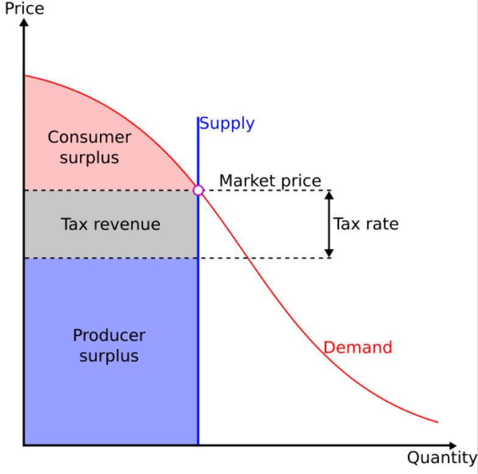
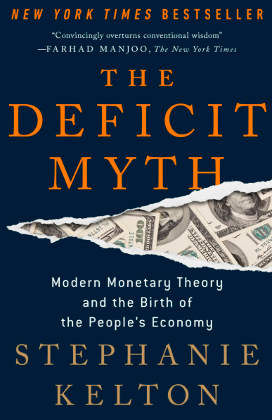
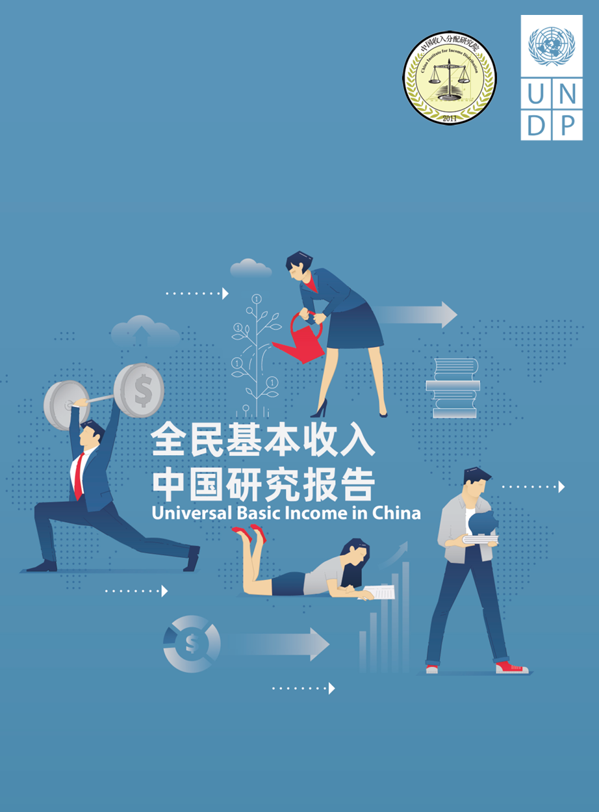
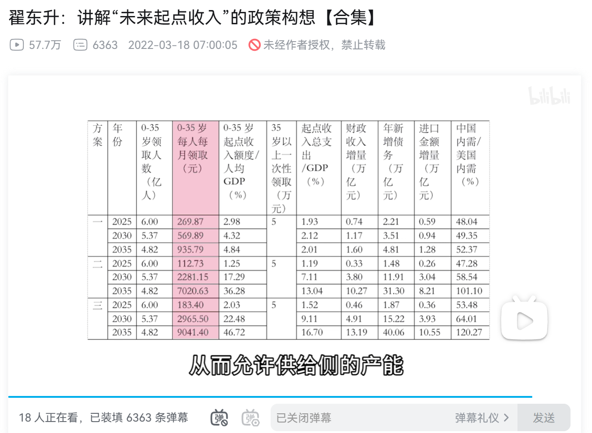

## 6/28 第三章内容：全民发薪制度可行吗？从乔治主义说起。

【一、介绍新成员】

（艾达和亚当进行5s的休息状态循环动作）

hello大家好，我是刘杰夫，今天我们主要讨论试图解决地租收益分配问题的乔治主义以及全民发薪制度。在正式开始之前，给大家一下介绍我的两位小伙伴：

艾达：你们好，我是艾达，刘杰夫非让我来，我是计算机专家，不过经济学看起来也很有意思，我就学学吧。

亚当：你们好，我是亚当史密斯，我听说刘杰夫在和你们一起读经济学的书，我主要是来监督的，如果他哪里讲的有问题，我会打断他！

有亚当史密斯的话我也能放心一点，怕讲的离谱了传播错误概念。

好吧，那你们可以先关掉浮窗，如果有问题随时出来。

艾达：好吧，快点开始吧，我等会儿还要去看星际牛仔。

亚当：你今天要讲的是，我看看……哦，杀死宿主的第三章内容，这个我熟悉。行吧，那你好好讲吧。

好那我争取让你俩和观众老爷们满意哈。从今天开始我的两位小伙伴会和我一起继续完成杀死宿主的第三章。

【地租收益回顾，乔治主义的提出】

在前两章呢，我们回顾了地租经济在英国的千年演变，对地租收益有了一个初步的了解；同时我们也知道了古典经济学家们对遏制地租经济，并让地租收益，也即食利所得收益，即取自人民的收益，最终通过财政及再分配或是基础设施、社会福利的形式再回归于人民。

第三章的主要内容依旧是围绕劳动所得和非劳动所得，也即地租性收益展开，相关内容在上个视频后半部分我们已经做了介绍与讲解，那我在这里按时间顺序做一个高度的总结。

约翰洛克提出个人劳动应当属于个人所有，从而开启了对劳动本身的区分；魁奈强力支持对土地地租征税，并反对以地租经济为主要收入来源的食利阶层，主张将自然资源收益用于公共财政；亚当斯密进一步支持对地租征税，并支持对工业劳动进行保护，大力支持制造业，抨击地租破坏社会效率；接着，大卫李嘉图进一步支持遏制地租。约翰·斯图亚特·密尔认为地主睡大觉的时候变富是不道德的，这种特权应当被剥夺，因此主张对自然增值部分课税。

当然，并非所有经济学家都反对地租收益。马尔萨斯为地租进行正当化辩护，视其为经济增长动力。但在理论角逐过程中，反对地租收益的派别逐步占据上风，并最终在美国经济学家亨利乔治的集成下形成了乔治主义（Georgism），历史上也称为单一税收运动（single tax movement）。

乔治主义的主要观点是：尽管人们应该拥有她们通过生产活动创造的财富，但是所有由自然而来的东西，尤其是土地，应当平等地属于所有社会成员。乔治主义主张对土地价值进行评估，并在此基础上征收地价税（land value tax）。

著名的支持乔治主义的人有马克·吐温、列夫·托尔斯泰、孙中山等。孙中山先生所说的“平均地权”，就是受到了乔治主义的重大影响。孙中山认为，土地是最基本的生产要素，私人垄断土地危害过大必须予以修正。

清末民初的时候，地主阶级土地兼并严重，农民生活困苦。革命党人基本都支持对土地制度进行改革，但是辛亥革命胜利后，国民党并没能掌握权力，最终导致军阀混战。等到1927年蒋介石在形式上统一中国的时候，国民党的纲领已经和孙中山最初所构想的平均地权发生了巨大的分歧。同时，由于中华民国并没能完成资本主义改造，整个社会的治理结构和模式并没能比清末好多少，中国大地上党派林立，因此最终乔治主义及平均地权的思想作为一种系统性的资本主义式的改革方案基本就是流于喊口号了。

与此同时，和乔治主义并行发展的社会主义也主张土地改造，但是社会主义的改造目标和手段却有很大的不同。乔治主义主张通过单一土地税来保护自由市场，而社会主义主张直接将全部土地视为公有财产。随着国民党的失败，共产党的胜利和新中国的成立，中国的土地逐步全部归国家所有，并持续至今。中国最终用社会主义的方式完成了地租收益问题的改造。

【乔治主义】

熟悉西方的小伙伴可能知道西方很多国家有房产税，比如美国，几乎所有住宅都要征收房产税。但是房产税和土地税却有很大的不同，亚当史密斯，你能对此做一个解释吗？这块我其实也有点糊涂。

亚当史密斯（下面是亚当史密斯的部分）：好呀，那我来解释一下美国的房地产税和乔治主义的土地税的不同。

首先，乔治主义主张征收土地单一税（land value tax, LVT），也成为“地价税”。LVT主要式对土地本身进行征税，

这是一个最简单的供求关系图，由于土地供应量在短期内是固定的，因此对土地征税时，土地数量即供给不变，因此增加税收后不会改变供给。换句话说，税收负担完全落在了土地所有者身上，而租金价格和交易量并没有变化，也没有造成无谓损失（deadweight loss）。

而今天美国主要施行的房地产税（property tax），不仅对土地征税，还对土地上面盖着的房屋、车库、商铺等建筑征税。房地产税在美国建国之前就已经存在了，由于土地价值难以单独估算、土地拥有者以权贵为主导致政策难以推行、制度依赖等原因，LVT未能获得推广。

【全民发薪制度】

谢谢亚当史密斯，那么我们回到主题上来。在本章最后，作者再次强调，李嘉图忽视了利息的本质和土地地租类似，而今天金融部门已经取代了过去的地主，成为主导性的食利阶层。债务服务和利息支付承担了李嘉图时代地租所扮演的角色。

马尔萨斯曾在支持地租收益时提到，地主会把地租收益拿来买奢侈品。而今天，债权人获得利息后，往往会将收入再次投入到金融部门中，从而制造了更多的债务。在这种你来我去的游戏之下，金融费用叠加在土地与垄断租金的基础上，造成了债务服务支出的膨胀，从而带来了一个严重的社会问题，即：债务增长的速度远远超过了实际经济的偿还能力。

我们之前提了很多金融资本主义的危害，那么我们今天来介绍一个尝试解决该问题的经济学流派，它非常有名，也非常有争议，他就是无条件基本收入制度（Universal Basic Income, UBI），也即全民发薪制度。该方案不是某个单独的经济学派所推出的，但是被后凯恩斯主义、现代货币理论等多次讨论。那当然，现代货币理论和后凯恩斯主义并不是完全研究全民发薪的，这个只是其中的一小部分。刚才我们提到的债务增长问题就是现代货币理论的主要研究内容，其中有个代表性人物，Stephanie Kelton，即那本非常有名的The Deficit Myth的作者，也是桑德斯的财政政策顾问，之后有机会的话我们一块开一个The Deficit Myth的系列，这本书目前只有繁体中文版，翻译为赤字迷思。简中网友有时候也把这本书叫做“赤字神话”。

为什么我在这里突然提到全民发薪制度呢？虽然大家觉得全民发薪制度不靠谱，但其实全世界范围内各国政府都开始非常小规模的测试了，只是这个事情一般不会拿出来大肆宣传，毕竟比较拉仇恨。

在中国其实有一些大家可能不太知道的地方，以鄂尔多斯为例，当地煤炭资源丰富，因此有过一些试点的政策，比如在一些地区按户分红，只要你是当地人，就能每年拿到一定数额的收入。这其实就是让土地等自然资源的收益归全体人民所享有。

在美国呢，其实也有类似的测试。阿拉斯加有一个叫做阿拉斯加永久基金的组织，会把石油开采收益的一部分永久投入到基金中，然后每年该基金会向阿拉斯加的居民发放现金红利，每年发放的金额不太一样，一般在1000-2000美元左右，不是很多。

全民发薪的讨论其实是越来越多了，是因为当下这个世界形势，不得不让我们去考虑这个问题。首先，自动化部署规模越来越大， 有人说，中国的劳动力这么便宜，为什么还要大力推广机器人？这是没办法的事情，因为你不搞机器人，别人也会搞，这是军备竞赛。但是现在全世界的主流国家，分配方式还是按股权分配，而非按劳动分配的。也就是说，如果自动化规模进一步提升，那么大多数人将直接面临吃不上饭的问题。

我可不是在危言耸听。中国的著名经济学家翟（di）东升最近就在频繁露面，推广给年轻人发钱的政策。翟东升多次提到中国广泛存在的代际剥削的问题，中老年人通过房地产赚了一波，然后90后00后进社会的时候发型买不起房了，于是大批大批的人不得不去从事有害身心健康的996工作。于是翟东升最近在推广一个给35岁以下年轻人发钱的政策，希望通过该政策提升中国的高端科技领域竞争力，并减少代际剥削带来的问题。换句话说，就是让那些吃了时代红利的人，吐钱出来回馈年轻人，不要让中国绝后，走日本的老路。

而我国政府目前也在反复研究共同富裕的实现方法。想要共同富裕，必然绕不开全民发薪制度。没有对中国青年人的定向补助，中国会面临非常严重的问题。目前中国主要解决了绝对贫困群体的问题，但是中产阶级萎缩和贫富分化严重的问题还有待解决。但是问题么一个一个解决，也不可能一口吃成大胖子，会消化不良。

2019年，联合国开发计划署和北京师范大学中国收入分配研究院合作发布《全民基本收入中国研究报告》

2024年，四川省广汉市三星村举行集体经济分红大会，共发放超过31万元。

在B站你可以看到翟东升的改造版全民基本收入，感兴趣的小伙伴可以去看一下，里头对发薪的种种疑问提出了大量的回答。

当然，目前该理论还处于研究讨论阶段。美国在前两年的疫情期间，前后共发放了三次支票给纳税人，从结果来看效果十分有限。美国如今深陷金融资本主义食利化的问题，加上如今保守派政党执政，共同富裕的问题基本上是搁置了。对于信奉基督教的美国保守派来说，穷人穷是活该，富人是上帝的选民理应更富。

而中国政府长期坚持共同富裕的纲领，因此我个人认为，中国很有希望成为新制度的带头者。大家知道，中国到目前为止几乎所有的发展模式和制度理论，基本在西方都能找到对应的影子。但是中国式现代化如果能解决收入分配问题，解决代际剥削的问题，那中国很有可能会创建出一个全新的社会制度，不仅有可能成为全球最先落地全民发薪制度的国家，还有可能探索出一个全新的制度，最终引领中国成为世界上最富裕的国家。

其实，很多人常常会觉得，现在的社会问题太多了，感觉这个世界真的很黑暗。但如果我们回头看看历史，其实在任何时代、任何国家，社会里都存在各种腐败、黑暗，甚至让人难以想象的事情。这些问题，并不是我们这个时代特有的，而是一直以来都存在。

拿新自由主义来说吧。它确实带来了很多问题，比如金融资本主义的扩张，还有一些制度上的腐败。但它也在某种程度上，间接推动了一些科技的发展。因为金融资本想要让资本增值、利润最大化，它就会特别关注那些可以提高效率、降低人力成本的行业。而虚拟经济——比如互联网、信息技术这些领域——刚好符合这个特点：不需要太多员工，却能创造很高的产出。

正是因为这种资本的推动，硅谷才能获得源源不断的资金支持，并获得了持续的繁荣。在这一波浪潮中，从英伟达到今天的人工智能发展，对人类来说都是高贵的财富。科技虽然不能直接让人们富裕，但是科技的发展却离不开资本的逐利。或许科技发展只是资本逐利的副产品，毕竟资本发展的目的一定不是为了共同富裕，所以制度建设就显得尤为重要了。
